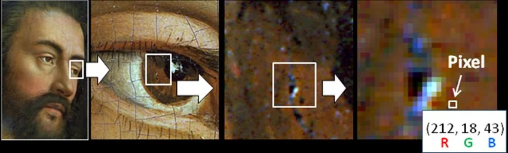
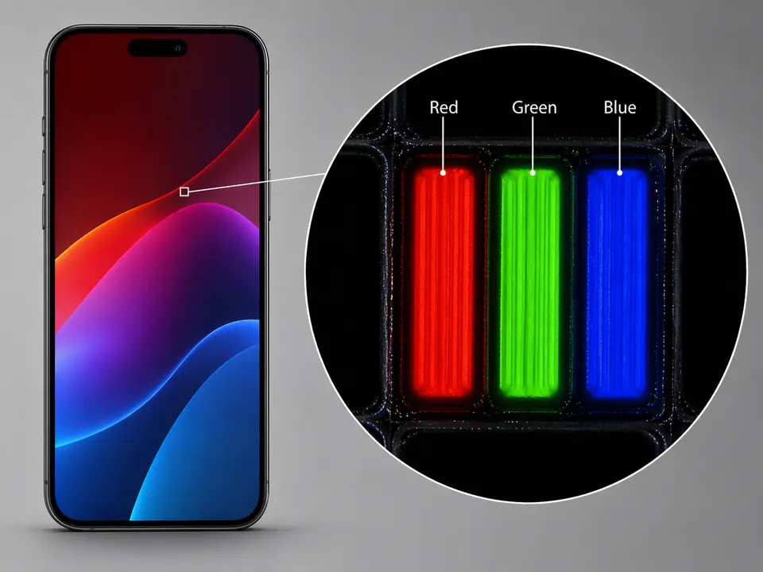
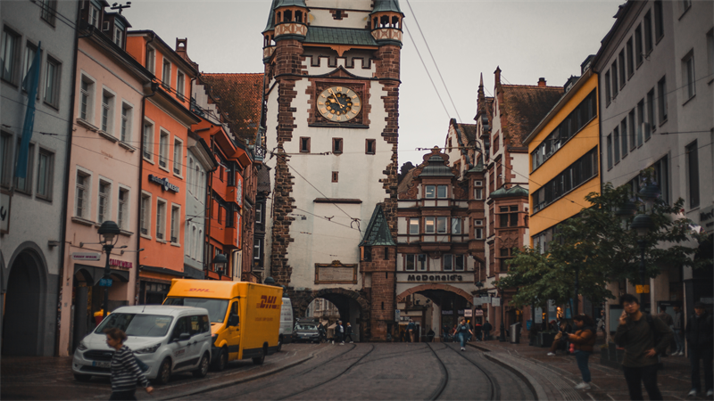
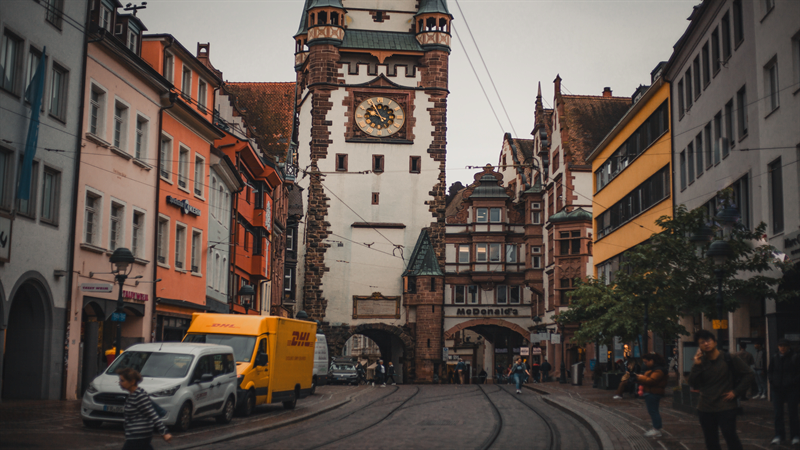

I like **steganography** because it feels *sneaky in a very gentle way*.

**Cryptography** says: "I have a message, but you cannot read it." **Steganography** says: "*Message? What message?*" It is the art of hiding **the existence of the message itself**. Not a locked box, exactly. More like a note folded into the wallpaper.

The little color story that started this article is beautifully simple: one **pixel** is <span class="inline-yellow">yellow</span>, another pixel is <span class="inline-green">green</span>, and if we borrow only the *tiny parts* of the green pixel that the eye barely notices, the yellow still looks yellow. But the green leaves a trace. <span class="inline-quiet">Quiet</span>, but there.

That is the whole mood of steganography. The <span class="inline-secret">secret</span> does not shout. It just moves into the **least suspicious place in the room**.

## A Short History of Hiding in Plain Sight

### The Message "Under the Surface"

One of the oldest stories in history is the story of the Greek ruler **Histiaeus**, who was trapped and wanted to send a secret message for a military revolt. What did he do? He brought his trusted servant, shaved his head completely, and tattooed the message on his scalp! He waited a few weeks until the hair grew back and covered the tattoo, then sent him off. The messenger passed through all the guards and checkpoints like an ordinary traveler carrying no paper at all. The message was not encrypted. It was literally hidden "under the surface".

### Secrets Hidden in Knitting Stitches

And if we want a less ancient example, during World War II, spies, especially women, used knitting to hide dangerous military messages and details about train movements! You would look at the sweater or shawl and think it was just a normal piece of clothing, but the type of stitch and its order formed **Morse code**. The secret was hiding in the middle of the room, visible to everyone, but no one suspected it.

### The Paper That Changes Its Mind

Then, of course, came the era of invisible inks: lemon juice, hidden ink, and chemicals. All those little activities we used to do as kids, getting excited when a blank page suddenly changed and gave away its secret when we exposed it to heat or certain kinds of light. All of these were ways of hiding information without realizing it.

### The Digital Age: Hiding Inside "Noise"

And when we entered the age of computers, technology opened doors to new places where we could hide messages: **noise**.

The digital images we see every day are full of extremely fine details and color gradients. To the computer, an image is just numbers, but our eyes interpret them as colors. That is why today we can hide information inside a digital image, and that is what we are going to explore today.

## Pixels and Hex Without the Headache

A **pixel** is one tiny spot of color in a digital image. More precisely, it is the smallest part of the image that the computer can point to and give a color. A photo is just a huge grid of these tiny spots. One pixel alone does not say much, but when millions of pixels sit next to each other, your eye blends them into a face, a street, a sky, or a cat doing something suspicious.



*From far away, your eye blends all those tiny color decisions into one smooth image. Up close, the picture turns back into little squares with numbers behind them.*

Most digital colors are stored as three color channels: <span class="inline-red">red</span>, <span class="inline-green">green</span>, and <span class="inline-blue">blue</span>. You will often see that written as <span class="inline-red">R</span><span class="inline-green">G</span><span class="inline-blue">B</span>. Each channel is a number that says how much of that color of light is in the pixel.

Each channel usually goes from `0` to `255`. **Zero** means none of that color. `255` means that channel is fully on. So one pixel is simply three channel values sitting next to each other:



**Hex** is the same color written in a shorter format. Hex counts `0` through `9`, then `A` through `F`, so one color channel fits into two hex digits from `00` to `FF`.

Start with decimal RGB values: `255, 195, 89`.

Turn each channel into a two-digit hex pair: `255 -> FF`, `195 -> C3`, `89 -> 59`.

Then place the three pairs side by side and add `#`: `#FFC359`.

That is all `#RRGGBB` means: one pair for <span class="inline-red">red</span>, one for <span class="inline-green">green</span>, and one for <span class="inline-blue">blue</span>.

You do not need to calculate it in your head every time. The only important idea here is this: each color channel has a <span class="inline-loud">loud part</span> and a <span class="inline-quiet">quiet part</span>. Steganography likes the <span class="inline-quiet">quiet part</span>.

Here is a more playful way to see it. **Move around the pixel field.** The big **hex code** updates from the square under the lens, and the bit rows show how every color channel is really *eight little on/off decisions*.

```html-live
<!-- sandbox-height: 500 -->
<style>
  body {
    min-height: 100vh;
    margin: 0;
    padding: 24px 16px;
    background: #0f1012;
    color: #e0e0e0;
    font-family: "Roboto Flex", system-ui, sans-serif;
    display: flex;
    justify-content: center;
    align-items: center;
    overflow: hidden;
  }

  .lab {
    width: 100%;
    max-width: 900px;
    display: flex;
    gap: 48px;
    align-items: center;
    justify-content: center;
  }

  .stage {
    flex: 1.2;
    position: relative;
    max-width: 520px;
  }

  canvas {
    width: 100%;
    height: auto;
    aspect-ratio: 16 / 9;
    background:
      radial-gradient(circle at top left, rgba(255, 196, 87, 0.12), transparent 34%),
      radial-gradient(circle at bottom right, rgba(255, 126, 62, 0.1), transparent 40%),
      #0f1012;
    border-radius: 18px;
    border: 1px solid rgba(255,255,255,0.12);
    box-shadow:
      inset 0 1px 0 rgba(255,255,255,0.06),
      0 18px 48px rgba(0,0,0,0.55);
    cursor: crosshair;
    touch-action: none;
    user-select: none;
    -webkit-user-select: none;
  }

  .formulas {
    flex: 0.8;
    display: flex;
    flex-direction: column;
    gap: 28px;
    font-family: "Courier New", Courier, monospace;
    font-size: 18px;
  }

  .hex-title {
    font-size: 42px;
    font-weight: bold;
    color: #fff;
    letter-spacing: 2px;
    margin-bottom: 0px;
  }

  .channel {
    display: flex;
    align-items: center;
    gap: 16px;
  }

  .ch-name {
    width: 18px;
    font-weight: bold;
  }

  .ch-val {
    width: 36px;
    text-align: right;
    color: #888;
  }

  .ch-hex {
    width: 30px;
    text-align: center;
    font-weight: bold;
  }

  .bits {
    display: flex;
    gap: 6px;
    margin-left: 12px;
  }

  .bit {
    font-size: 15px;
    color: #333;
    transition: color 0.15s ease-out, transform 0.2s cubic-bezier(0.2, 0.9, 0.3, 1.3);
  }

  .bit.on {
    transform: translateY(-2px);
  }

  .r-row .ch-name, .r-row .ch-hex, .r-row .bit.on { color: #ff7a70; text-shadow: 0 0 12px rgba(255,122,112,0.34); }
  .g-row .ch-name, .g-row .ch-hex, .g-row .bit.on { color: #9be26a; text-shadow: 0 0 12px rgba(155,226,106,0.28); }
  .b-row .ch-name, .b-row .ch-hex, .b-row .bit.on { color: #78cfff; text-shadow: 0 0 12px rgba(120,207,255,0.28); }

  @media (max-width: 760px) {
    .lab {
      flex-direction: column;
      gap: 36px;
      padding: 0;
    }
    .hex-title {
      font-size: 32px;
      text-align: center;
    }
    .formulas {
      font-size: 14px;
      width: 100%;
      align-items: center;
      gap: 20px;
    }
    .channel {
      gap: 12px;
    }
    .bits {
      margin-left: 4px;
      gap: 4px;
    }
  }
</style>

<div class="lab" dir="ltr">
  <div class="stage">
    <canvas id="pixel-canvas" width="600" height="340"></canvas>
  </div>
  <div class="formulas">
    <div id="hex-view" class="hex-title">#000000</div>
    <div id="ch-r" class="channel r-row"><div class="ch-name">R</div><div class="ch-val">0</div><div class="ch-hex">00</div><div class="bits"></div></div>
    <div id="ch-g" class="channel g-row"><div class="ch-name">G</div><div class="ch-val">0</div><div class="ch-hex">00</div><div class="bits"></div></div>
    <div id="ch-b" class="channel b-row"><div class="ch-name">B</div><div class="ch-val">0</div><div class="ch-hex">00</div><div class="bits"></div></div>
  </div>
</div>

<script>
  const canvas = document.getElementById('pixel-canvas');
  const ctx = canvas.getContext('2d');
  const cols = 20;
  const rows = 12;
  
  // Setup HTML bit structures
  ['r', 'g', 'b'].forEach(ch => {
    const bitsEl = document.querySelector(`#ch-${ch} .bits`);
    for(let i=0; i<8; i++) {
        const bit = document.createElement('div');
        bit.className = 'bit';
        bit.textContent = '0';
        bitsEl.appendChild(bit);
    }
  });

  function clamp(val, min, max) { return Math.max(min, Math.min(max, val)); }
  function toHex(val) { return Math.round(val).toString(16).padStart(2, '0').toUpperCase(); }
  function mix(a, b, t) { return a + (b - a) * t; }
  function blendColor(colorA, colorB, t) {
    return colorA.map((value, index) => mix(value, colorB[index], t));
  }
  
  function pixelColor(col, row) {
    const x = col / (cols - 1);
    const y = row / (rows - 1);

    const topLeft = [248, 214, 112];
    const topRight = [255, 168, 74];
    const bottomLeft = [88, 29, 146];
    const bottomRight = [129, 37, 183];

    const topBand = blendColor(topLeft, topRight, x);
    const bottomBand = blendColor(bottomLeft, bottomRight, x);
    let rgb = blendColor(topBand, bottomBand, y);

    const centerGlow = Math.max(0, 1 - Math.hypot(x - 0.5, y - 0.64) / 0.78);
    rgb = blendColor(rgb, [204, 58, 160], centerGlow * 0.46);

    const orangeBloom = Math.max(0, 1 - Math.hypot(x - 0.2, y - 0.24) / 0.5);
    rgb = blendColor(rgb, [255, 137, 62], orangeBloom * 0.2);

    const yellowBloom = Math.max(0, 1 - Math.hypot(x - 0.78, y - 0.12) / 0.42);
    rgb = blendColor(rgb, [255, 232, 109], yellowBloom * 0.18);

    const wave = Math.sin(x * 4.2 - y * 2.4) * 13 + Math.cos(y * 4.9 + x * 1.3) * 8;
    rgb = rgb.map((value, index) => value + wave * [0.72, 0.22, 0.62][index]);

    if (col === 5 && row === 4) rgb = [255, 0, 0];
    if (col === 14 && row === 7) rgb = [0, 255, 0];
    if (col === 17 && row === 3) rgb = [0, 0, 255];
    
    return rgb.map(v => clamp(v, 0, 255));
  }

  const pixels = Array.from({length: rows}, (_, r) => 
    Array.from({length: cols}, (_, c) => pixelColor(c, r))
  );

  let target = {col: 5, row: 4};
  let focus = {col: 5, row: 4};
  let lastColorStr = '';
  let activePointerId = null;

  function updateMath(rgb) {
    const hex = '#' + rgb.map(toHex).join('');
    document.getElementById('hex-view').textContent = hex;
    
    ['r', 'g', 'b'].forEach((ch, idx) => {
      const val = Math.round(rgb[idx]);
      const rowEl = document.getElementById(`ch-${ch}`);
      rowEl.querySelector('.ch-val').textContent = val;
      rowEl.querySelector('.ch-hex').textContent = toHex(val);
      
      const bitStr = val.toString(2).padStart(8, '0');
      const bitNodes = rowEl.querySelector('.bits').children;
      for(let i=0; i<8; i++) {
         bitNodes[i].textContent = bitStr[i];
         if(bitStr[i] === '1') bitNodes[i].classList.add('on');
         else bitNodes[i].classList.remove('on');
      }
    });
  }

  function setTargetFromPointer(e) {
    const rect = canvas.getBoundingClientRect();
    const x = (e.clientX - rect.left) / rect.width;
    const y = (e.clientY - rect.top) / rect.height;
    target.col = clamp(Math.floor(x * cols), 0, cols - 1);
    target.row = clamp(Math.floor(y * rows), 0, rows - 1);
  }

  canvas.addEventListener('pointermove', e => {
    if (e.pointerType === 'touch' && activePointerId !== e.pointerId) return;
    setTargetFromPointer(e);
  });
  canvas.addEventListener('pointerdown', e => {
     activePointerId = e.pointerId;
     setTargetFromPointer(e);
     canvas.setPointerCapture(e.pointerId);
     e.preventDefault();
  });
  canvas.addEventListener('pointerup', e => {
     if (activePointerId === e.pointerId) activePointerId = null;
  });
  canvas.addEventListener('pointercancel', e => {
     if (activePointerId === e.pointerId) activePointerId = null;
  });
  canvas.addEventListener('lostpointercapture', () => {
     activePointerId = null;
  });

  function drawGrid(scalePass) {
    const cellW = canvas.width / cols;
    const cellH = canvas.height / rows;
    for (let row = 0; row < rows; row++) {
      for (let col = 0; col < cols; col++) {
        ctx.fillStyle = '#' + pixels[row][col].map(toHex).join('');
        ctx.fillRect(col * cellW, row * cellH, cellW + 1, cellH + 1);
        if (!scalePass) {
          ctx.strokeStyle = 'rgba(27, 18, 40, 0.14)';
          ctx.lineWidth = 1;
          ctx.strokeRect(col * cellW, row * cellH, cellW, cellH);
        }
      }
    }
  }

  function draw() {
    focus.col += (target.col - focus.col) * 0.15;
    focus.row += (target.row - focus.row) * 0.15;
    
    ctx.clearRect(0, 0, canvas.width, canvas.height);
    drawGrid(false);

    const cellW = canvas.width / cols;
    const cellH = canvas.height / rows;
    const cx = (focus.col + 0.5) * cellW;
    const cy = (focus.row + 0.5) * cellH;

    ctx.save();
    ctx.beginPath();
    ctx.arc(cx, cy, 65, 0, Math.PI * 2);
    ctx.clip();
    
    ctx.translate(cx, cy);
    ctx.scale(2.8, 2.8);
    ctx.translate(-cx, -cy);
    drawGrid(true);
    ctx.restore();

    ctx.beginPath();
    ctx.arc(cx, cy, 65, 0, Math.PI * 2);
    ctx.strokeStyle = 'rgba(255,225,53,0.9)';
    ctx.lineWidth = 2;
    ctx.setLineDash([4, 4]);
    ctx.stroke();
    
    ctx.setLineDash([]);
    ctx.strokeStyle = 'rgba(255, 242, 186, 0.96)';
    ctx.lineWidth = 1.5;
    ctx.strokeRect(target.col * cellW + 2, target.row * cellH + 2, cellW - 4, cellH - 4);

    const sc = clamp(Math.round(focus.col), 0, cols - 1);
    const sr = clamp(Math.round(focus.row), 0, rows - 1);
    const pColor = pixels[sr][sc];
    const cStr = pColor.join();
    if (cStr !== lastColorStr) {
      updateMath(pColor);
      lastColorStr = cStr;
    }

    requestAnimationFrame(draw);
  }

  updateMath(pixels[target.row][target.col]);
  draw();
</script>
```

## How To Hide A Pixel Inside A Pixel!

As we said, every pixel is made of three variables: <span class="inline-red">red</span>, <span class="inline-green">green</span>, <span class="inline-blue">blue</span>. And we describe each variable with a number from `0` to `255`.
Inside the computer, that number is stored as **8 bits**. A bit is simply a binary slot that stores either `0` or `1`.

That means an `RGB` pixel contains **3 bytes** in total: one `byte` for red, one `byte` for green, and one `byte` for blue. And each `byte` is made of **8 bits**. So in this trick, we are not taking `4 bytes` from a channel, because each channel is already just one `byte`. What we actually take is **4 strong bits from each channel**.

The question here is: do all bits have the same importance?

Let's touch the math for a moment, but don't worry, it is not complicated. Bits work on powers of 2 (that is, $2^x$).
The first bit (from the right) is worth $2^0 = 1$, the next is $2^1 = 2$, and so on until we reach the eighth bit, which is worth $2^7 = 128$.

$$
\begin{array}{cccccccc}
2^7 & 2^6 & 2^5 & 2^4 & 2^3 & 2^2 & 2^1 & 2^0 \\
\mathbf{128} & \mathbf{64} & \mathbf{32} & \mathbf{16} & \mathbf{8} & \mathbf{4} & \mathbf{2} & \mathbf{1}
\end{array}
$$

If we split the 8 bits into two halves:
- **The Strong Half (Most Significant Bits):** These are the 4 bits on the left. Their values are the big numbers ($128, 64, 32, 16$). This half is what mainly defines the **identity of the color**.
- **The Quiet Half (Least Significant Bits):** These are the 4 bits on the right. Their values are very small ($8, 4, 2, 1$). If we add them all up, they give us only $15$ out of the full $255$! That means their effect on the color does not go beyond about $6\%$, so changing them creates such a tiny difference that the human eye usually cannot notice it.

In other words, the quiet half (the 4 weak bits) can be treated as **empty space** or a "secret room" that we can use.

### The Trick: Merge Two Colors Into One Pixel

To hide a <span class="inline-secret-hex">secret pixel</span> `#8FC56C` inside a <span class="inline-cover-hex">cover pixel</span> `#FFC359`, we do this:
1. From each channel in the **cover pixel**, we clear the **4 quiet bits** on the right.
2. From each channel in the **secret pixel**, we take the **4 strong bits** on the left.
3. We place those **4 strong bits** where the **4 quiet bits** used to be in the cover.

The result is a <span class="inline-carrier-hex">carrier pixel</span> `#F8CC56` that looks extremely close to the cover pixel, but secretly carries the hidden data inside it.

Let's see it as a diagram that shows **the three channels together**. The same trick happens inside every channel:

```html-live
<!-- sandbox-height: 560 -->
<!-- sandbox-chrome: none -->
<style>
  :root {
    color-scheme: dark;
    --cover: #ffc359;
    --secret: #8fc56c;
    --carrier: #f8cc56;
    --ink: #17141a;
    --muted: rgba(23, 20, 26, 0.54);
    --panel: rgba(15, 16, 18, 0.92);
    --row-bg: rgba(255, 255, 255, 0.16);
    --row-border: rgba(255, 255, 255, 0.14);
    --red-ink: #a22b1c;
    --green-ink: #2f6325;
    --blue-ink: #1e4b83;
  }

  html, body {
    width: 100%;
    height: auto;
    overflow: visible;
    background: transparent;
  }

  body {
    min-height: 0;
    margin: 0;
    padding: 4px 8px 8px;
    display: flex;
    justify-content: center;
    align-items: flex-start;
    font-family: "Inter", "Roboto Flex", system-ui, sans-serif;
    box-sizing: border-box;
  }

  .diagram-shell {
    width: 100%;
    height: 100%;
    max-width: 820px;
    margin: 0 auto;
    position: relative;
  }

  .diagram {
    position: absolute;
    inset: 0 auto auto 0;
    width: 820px;
    height: 540px;
    transform-origin: top left;
    box-sizing: border-box;
  }

  .arrow-layer {
    position: absolute;
    inset: 0;
    width: 100%;
    height: 100%;
    overflow: visible;
  }

  .card {
    position: absolute;
    width: 292px;
    padding: 14px 14px 14px;
    border-radius: 20px;
    border: 1.5px solid rgba(255, 255, 255, 0.18);
    box-shadow:
      inset 0 1px 0 rgba(255, 255, 255, 0.22),
      0 10px 28px rgba(0, 0, 0, 0.18);
    text-align: center;
    box-sizing: border-box;
    display: flex;
    flex-direction: column;
    align-items: center;
    gap: 7px;
  }

  .card.cover {
    top: 28px;
    left: 8px;
    background: var(--cover);
  }

  .card.secret {
    top: 284px;
    left: 8px;
    background: var(--secret);
  }

  .card.carrier {
    top: 156px;
    right: 8px;
    background: var(--carrier);
  }

  .title {
    color: var(--ink);
    font-size: 18px;
    font-weight: 900;
    line-height: 1.15;
  }

  .hex {
    color: rgba(23, 20, 26, 0.9);
    font-family: "JetBrains Mono", "Fira Code", monospace;
    font-size: 13px;
    font-weight: 900;
    direction: ltr;
    unicode-bidi: isolate;
  }

  .channel-grid {
    width: 100%;
    display: grid;
    gap: 6px;
  }

  .channel-row {
    display: grid;
    grid-template-columns: 18px 34px minmax(0, 1fr);
    align-items: center;
    gap: 8px;
    padding: 6px 8px;
    border-radius: 12px;
    background: var(--row-bg);
    border: 1px solid var(--row-border);
    box-sizing: border-box;
  }

  .channel-label,
  .channel-pair,
  .channel-bits {
    font-family: "JetBrains Mono", "Fira Code", monospace;
    direction: ltr;
    unicode-bidi: isolate;
  }

  .channel-label {
    font-size: 13px;
    font-weight: 900;
    text-align: center;
  }

  .channel-pair {
    font-size: 13px;
    font-weight: 900;
    text-align: center;
  }

  .channel-bits {
    color: var(--ink);
    font-size: 14px;
    font-weight: 900;
    letter-spacing: 0.02em;
    text-align: left;
    text-shadow: 0 1px 0 rgba(255, 255, 255, 0.14);
  }

  .channel-bits .bit-divider {
    display: inline-block;
    margin: 0 0.22em;
    color: rgba(23, 20, 26, 0.34);
  }

  .channel-bits .muted {
    color: var(--muted);
  }

  .channel-bits .from-secret-bit {
    color: var(--green-ink);
  }

  .channel-row.red .channel-label,
  .channel-row.red .channel-pair {
    color: var(--red-ink);
  }

  .channel-row.green .channel-label,
  .channel-row.green .channel-pair {
    color: var(--green-ink);
  }

  .channel-row.blue .channel-label,
  .channel-row.blue .channel-pair {
    color: var(--blue-ink);
  }

  .arrow-label rect {
    fill: var(--panel);
    rx: 15;
    ry: 15;
  }

  .arrow-label text {
    font-family: "Inter", "Roboto Flex", system-ui, sans-serif;
    font-size: 14px;
    font-weight: 900;
    dominant-baseline: middle;
    text-anchor: middle;
  }

  .arrow-label.cover text {
    fill: var(--cover);
  }

  .arrow-label.secret text {
    fill: var(--secret);
  }
</style>

<div class="diagram-shell" id="eng-byte-diagram-shell">
<div class="diagram" id="eng-byte-diagram" aria-label="Diagram showing how the three color channels of a secret pixel are merged into a cover pixel">
  <svg class="arrow-layer" viewBox="0 0 820 540" preserveAspectRatio="none" aria-hidden="true">
    <defs>
      <marker id="eng-arrow-cover" markerWidth="10" markerHeight="10" refX="8" refY="5" orient="auto">
        <path d="M0,0 L10,5 L0,10 z" fill="#FFC359"></path>
      </marker>
      <marker id="eng-arrow-secret" markerWidth="10" markerHeight="10" refX="8" refY="5" orient="auto">
        <path d="M0,0 L10,5 L0,10 z" fill="#8FC56C"></path>
      </marker>
    </defs>

    <path
      d="M300 118 C 400 118, 438 196, 506 240"
      fill="none"
      stroke="#FFC359"
      stroke-width="3.2"
      stroke-linecap="round"
      marker-end="url(#eng-arrow-cover)"
    />
    <path
      d="M300 374 C 400 374, 438 312, 506 276"
      fill="none"
      stroke="#8FC56C"
      stroke-width="3.2"
      stroke-linecap="round"
      stroke-dasharray="7 7"
      marker-end="url(#eng-arrow-secret)"
    />
    <g class="arrow-label cover" transform="translate(416 160) rotate(18)">
      <rect x="-86" y="-23" width="172" height="46"></rect>
      <text x="0" y="-9">Take the strong half</text>
      <text x="0" y="9">from each channel</text>
    </g>
    <g class="arrow-label secret" transform="translate(404 356) rotate(-15)">
      <rect x="-86" y="-23" width="172" height="46"></rect>
      <text x="0" y="-9">Hide the strong half</text>
      <text x="0" y="9">from each channel</text>
    </g>
  </svg>

  <div class="card cover">
    <div class="title">Cover Pixel</div>
    <div class="hex">#FFC359</div>
    <div class="channel-grid">
      <div class="channel-row red">
        <div class="channel-label">R</div>
        <div class="channel-pair">FF</div>
        <div class="channel-bits">1111<span class="bit-divider">|</span><span class="muted">1111</span></div>
      </div>
      <div class="channel-row green">
        <div class="channel-label">G</div>
        <div class="channel-pair">C3</div>
        <div class="channel-bits">1100<span class="bit-divider">|</span><span class="muted">0011</span></div>
      </div>
      <div class="channel-row blue">
        <div class="channel-label">B</div>
        <div class="channel-pair">59</div>
        <div class="channel-bits">0101<span class="bit-divider">|</span><span class="muted">1001</span></div>
      </div>
    </div>
  </div>

  <div class="card carrier">
    <div class="title">Carrier Pixel</div>
    <div class="hex">#F8CC56</div>
    <div class="channel-grid">
      <div class="channel-row red">
        <div class="channel-label">R</div>
        <div class="channel-pair">F8</div>
        <div class="channel-bits">1111<span class="bit-divider">|</span><span class="from-secret-bit">1000</span></div>
      </div>
      <div class="channel-row green">
        <div class="channel-label">G</div>
        <div class="channel-pair">CC</div>
        <div class="channel-bits">1100<span class="bit-divider">|</span><span class="from-secret-bit">1100</span></div>
      </div>
      <div class="channel-row blue">
        <div class="channel-label">B</div>
        <div class="channel-pair">56</div>
        <div class="channel-bits">0101<span class="bit-divider">|</span><span class="from-secret-bit">0110</span></div>
      </div>
    </div>
  </div>

  <div class="card secret">
    <div class="title">Secret Pixel</div>
    <div class="hex">#8FC56C</div>
    <div class="channel-grid">
      <div class="channel-row red">
        <div class="channel-label">R</div>
        <div class="channel-pair">8F</div>
        <div class="channel-bits"><span class="from-secret-bit">1000</span><span class="bit-divider">|</span><span class="muted">1111</span></div>
      </div>
      <div class="channel-row green">
        <div class="channel-label">G</div>
        <div class="channel-pair">C5</div>
        <div class="channel-bits"><span class="from-secret-bit">1100</span><span class="bit-divider">|</span><span class="muted">0101</span></div>
      </div>
      <div class="channel-row blue">
        <div class="channel-label">B</div>
        <div class="channel-pair">6C</div>
        <div class="channel-bits"><span class="from-secret-bit">0110</span><span class="bit-divider">|</span><span class="muted">1100</span></div>
      </div>
    </div>
  </div>
</div>
</div>
<script>
  const engDiagramShell = document.getElementById('eng-byte-diagram-shell');
  const engDiagram = document.getElementById('eng-byte-diagram');
  const engBaseWidth = 820;
  const engBaseHeight = 540;
  const engNotifyHeight = (height) => {
    if (window.parent) {
      window.parent.postMessage({ type: 'interactive-sandbox:height', height }, '*');
    }
  };

  if (engDiagramShell && engDiagram) {
    const syncEngDiagramScale = () => {
      const scale = engDiagramShell.clientWidth / engBaseWidth;
      const offsetX = Math.max(0, (engDiagramShell.clientWidth - engBaseWidth * scale) / 2);
      engDiagram.style.transform = `translate(${offsetX}px, 0px) scale(${scale})`;
      const bodyStyle = getComputedStyle(document.body);
      const paddingTop = parseFloat(bodyStyle.paddingTop) || 0;
      const paddingBottom = parseFloat(bodyStyle.paddingBottom) || 0;
      engNotifyHeight(engBaseHeight * scale + paddingTop + paddingBottom);
    };

    syncEngDiagramScale();
    new ResizeObserver(syncEngDiagramScale).observe(engDiagramShell);
  }
</script>
```

Or for a deeper understanding, let's see how the process happens at the level of the colors' hex codes:

```html-live
<!-- sandbox-height: 480 -->
<style>
  :root { color-scheme: dark; }
  html, body { width: 100%; height: auto !important; overflow: visible !important; }
  body {
    min-height: 0; margin: 0; padding: 24px 20px;
    background: #0f1012; color: #fff;
    font-family: "Inter", "Roboto Flex", system-ui, sans-serif;
    display: flex; justify-content: center; align-items: flex-start;
    box-sizing: border-box;
  }
  .sleek-lab {
    width: 100%; max-width: 900px; position: relative;
  }
  .top-bar { display: flex; justify-content: space-between; align-items: flex-end; gap: 20px; margin-bottom: 32px; flex-wrap: wrap; }
  .top-bar > div:first-child { min-width: 0; }
  .subtitle { font-size: 11px; letter-spacing: 0.2em; color: #58c4dd; text-transform: uppercase; margin-bottom: 8px; font-weight: 600; }
  h2 { margin: 0; font-size: clamp(24px, 4vw, 28px); font-weight: 300; letter-spacing: -0.02em; line-height: 1.08; }
  button {
    background: transparent; border: 1px solid rgba(255,255,255,0.2); color: #fff;
    padding: 10px 20px; border-radius: 999px; cursor: pointer; font-family: inherit; font-size: 12px; text-transform: uppercase; letter-spacing: 0.1em;
    transition: all 0.3s ease; flex-shrink: 0;
  }
  button:hover { background: #fff; color: #000; }
  
  .data-flow { display: flex; flex-direction: column; gap: 20px; }
  .channel-row {
    display: grid; grid-template-columns: 40px repeat(4, 1fr); align-items: center; gap: 16px;
    padding-bottom: 24px; border-bottom: 1px solid rgba(255,255,255,0.05);
  }
  .channel-row:last-child { border-bottom: none; padding-bottom: 0; }
  .ch-label { font-size: 24px; font-weight: bold; color: var(--color); text-shadow: 0 0 15px var(--color); text-align: center; }
  .byte-group { display: flex; flex-direction: column; align-items: center; gap: 6px; }
  .b-label { font-size: 10px; color: rgba(255,255,255,0.4); text-transform: uppercase; letter-spacing: 0.1em; }
  .byte { font-family: "JetBrains Mono", monospace; font-size: 32px; font-weight: 300; color: rgba(255,255,255,0.15); display: flex; gap: 6px; }
  .byte span { transition: all 0.5s cubic-bezier(0.4, 0, 0.2, 1); display: inline-block; }
  
  .r-chan { --color: #ff5f58; }
  .g-chan { --color: #28c940; }
  .b-chan { --color: #2da1ff; }

  .sleek-lab[data-step="0"] .cover .h1 { color: #fff; font-weight: 700; text-shadow: 0 0 15px rgba(255,255,255,0.6); transform: translateY(-3px); }
  
  .sleek-lab[data-step="1"] .cover .h1 { color: #fff; }
  .sleek-lab[data-step="1"] .secret .h1 { color: var(--color); font-weight: 700; text-shadow: 0 0 15px var(--color); transform: translateY(-3px); }
  
  .sleek-lab[data-step="2"] .carrier .h1 { color: #fff; font-weight: 700; }
  .sleek-lab[data-step="2"] .carrier .h2 { color: var(--color); font-weight: 700; text-shadow: 0 0 15px var(--color); transform: translateY(-2px) scale(1.05); }
  
  .sleek-lab[data-step="3"] .carrier .h1 { color: #fff; }
  .sleek-lab[data-step="3"] .carrier .h2 { color: var(--color); }
  .sleek-lab[data-step="3"] .reveal .h1 { color: var(--color); font-weight: 700; text-shadow: 0 0 15px var(--color); transform: translateY(-3px); }
  
  @media (max-width: 760px) {
    body { padding: 18px 12px 20px; }
    .top-bar { justify-content: space-between; align-items: flex-end; gap: 12px; margin-bottom: 24px; flex-wrap: nowrap; }
    .subtitle { margin-bottom: 6px; font-size: 10px; }
    .top-bar h2 { font-size: 20px; }
    button { padding: 8px 14px; font-size: 11px; }
    .data-flow { gap: 18px; }
    .channel-row { grid-template-columns: 24px repeat(2, minmax(0, 1fr)); column-gap: 12px; row-gap: 14px; padding-bottom: 20px; align-items: start; }
    .ch-label { grid-column: 1; grid-row: 1 / span 2; position: static; align-self: center; padding-top: 0; font-size: 20px; }
    .byte-group { display: flex; align-items: center; justify-content: center; gap: 6px; min-width: 0; }
    .b-label { text-align: center; font-size: 9px; }
    .byte { font-size: 24px; gap: 3px; justify-content: center; }
  }
</style>

<div class="sleek-lab" id="eng-lab" data-step="0">
  <div class="top-bar">
    <div>
      <div class="subtitle">Hide & Extract</div>
      <h2>Pixel Merge Simulation</h2>
    </div>
    <button id="eng-replay">Replay</button>
  </div>
  
  <div class="data-flow">
     <div class="channel-row r-chan">
        <div class="ch-label">R</div>
        <div class="byte-group cover"><div class="b-label">Cover</div><div class="byte"><span class="h1">F</span><span class="h2">F</span></div></div>
        <div class="byte-group secret"><div class="b-label">Secret</div><div class="byte"><span class="h1">8</span><span class="h2">F</span></div></div>
        <div class="byte-group carrier"><div class="b-label">Carrier</div><div class="byte"><span class="h1">F</span><span class="h2">8</span></div></div>
        <div class="byte-group reveal"><div class="b-label">Reveal</div><div class="byte"><span class="h1">8</span><span class="h2">0</span></div></div>
     </div>
     <div class="channel-row g-chan">
        <div class="ch-label">G</div>
        <div class="byte-group cover"><div class="b-label">Cover</div><div class="byte"><span class="h1">C</span><span class="h2">3</span></div></div>
        <div class="byte-group secret"><div class="b-label">Secret</div><div class="byte"><span class="h1">C</span><span class="h2">5</span></div></div>
        <div class="byte-group carrier"><div class="b-label">Carrier</div><div class="byte"><span class="h1">C</span><span class="h2">C</span></div></div>
        <div class="byte-group reveal"><div class="b-label">Reveal</div><div class="byte"><span class="h1">C</span><span class="h2">0</span></div></div>
     </div>
     <div class="channel-row b-chan">
        <div class="ch-label">B</div>
        <div class="byte-group cover"><div class="b-label">Cover</div><div class="byte"><span class="h1">5</span><span class="h2">9</span></div></div>
        <div class="byte-group secret"><div class="b-label">Secret</div><div class="byte"><span class="h1">6</span><span class="h2">C</span></div></div>
        <div class="byte-group carrier"><div class="b-label">Carrier</div><div class="byte"><span class="h1">5</span><span class="h2">6</span></div></div>
        <div class="byte-group reveal"><div class="b-label">Reveal</div><div class="byte"><span class="h1">6</span><span class="h2">0</span></div></div>
     </div>
  </div>
</div>

<script>
  const engLab = document.getElementById('eng-lab');
  let engTimers = [];

  function setEngStep(step) {
    engLab.dataset.step = String(step);
  }

  function playEng() {
    engTimers.forEach(clearTimeout);
    engTimers = [];
    setEngStep(0);
    [1, 2, 3].forEach((step, index) => {
      engTimers.push(setTimeout(() => setEngStep(step), (index + 1) * 1400));
    });
  }

  function notifyEngHeight() {
    requestAnimationFrame(() => {
      const height = Math.ceil(document.documentElement.scrollHeight);
      if (window.parent) {
        window.parent.postMessage({ type: 'interactive-sandbox:height', height }, '*');
      }
    });
  }

  document.getElementById('eng-replay').addEventListener('click', playEng);
  setEngStep(0);
  setTimeout(playEng, 400);
  new ResizeObserver(notifyEngHeight).observe(document.body);
  window.addEventListener('resize', notifyEngHeight);
  notifyEngHeight();
</script>
```

You might tell me: but there is still a difference between the cover color and the color that ended up carrying the secret. And that is true, but the difference stays **very slight**. Remember that an image is made of a huge number of pixels, so this difference is almost negligible when we look at the whole picture. The nicest part is that the image does not become noisy, and it does not scream "<span class="inline-secret">there is a secret here</span>". We only change a few *small numbers*, and bet that the eye will ignore them.

## Same Instinct, New Shapes

As you may have noticed over time, the <span class="inline-carrier">carrier</span> changed, but the instinct stayed the same.

```html-live
<!-- sandbox-height: 260 -->
<style>
  :root { color-scheme: dark; }
  body {
    margin: 0;
    padding: clamp(20px, 4vw, 32px);
    background: #0f1012;
    color: #e0e0e0;
    font-family: "Roboto Flex", system-ui, sans-serif;
  }
  .timeline-shell {
    width: 100%;
    max-width: 920px;
    margin: 0 auto;
  }
  .timeline {
    position: relative;
    display: flex;
    gap: clamp(16px, 3vw, 40px);
    align-items: flex-start;
    justify-content: space-between;
    padding-block: 12px 4px;
  }
  .track {
    position: absolute;
    height: 2px;
    background: linear-gradient(90deg, rgba(88,196,221,0.14), rgba(255,255,255,0.16), rgba(88,196,221,0.14));
    border-radius: 999px;
    box-shadow: 0 0 0 1px rgba(255,255,255,0.02);
    z-index: 0;
    pointer-events: none;
  }
  .node {
    position: relative;
    z-index: 1;
    display: flex;
    flex-direction: column;
    align-items: center;
    gap: 14px;
    text-align: center;
    flex: 1 1 0;
    min-width: 0;
  }
  .circle {
    width: 22px;
    height: 22px;
    border-radius: 50%;
    background: #0f1012;
    border: 2px solid #58c4dd;
    box-shadow: 0 0 0 6px rgba(15,16,18,0.92);
  }
  .node.is-active .circle {
    background: #58c4dd;
    box-shadow:
      0 0 0 6px rgba(15,16,18,0.92),
      0 0 20px rgba(88,196,221,0.55);
  }
  .copy {
    display: flex;
    flex-direction: column;
    align-items: center;
    gap: 8px;
    min-width: 0;
  }
  .label {
    font-weight: 700;
    color: #fff;
    font-size: clamp(14px, 1.8vw, 16px);
    line-height: 1.25;
    overflow-wrap: anywhere;
  }
  .desc {
    font-size: clamp(12px, 1.4vw, 13px);
    line-height: 1.45;
    color: #9197a0;
    max-width: 12ch;
    overflow-wrap: anywhere;
  }
  .packet {
    position: absolute;
    width: 10px;
    height: 10px;
    border-radius: 50%;
    transform: translate(-50%, -50%);
    background: #E8C170;
    box-shadow: 0 0 12px #E8C170;
    z-index: 2;
    opacity: 0;
    pointer-events: none;
  }
  .packet::before {
    content: "";
    position: absolute;
    inset: -8px;
    border-radius: inherit;
    background: rgba(232,193,112,0.3);
    filter: blur(8px);
    z-index: -1;
  }

  @media (max-width: 760px) {
    .timeline {
      flex-direction: column;
      gap: 22px;
    }
    .node {
      flex-direction: row;
      align-items: center;
      text-align: left;
      width: 100%;
      gap: 16px;
    }
    .copy { align-items: flex-start; }
    .desc { max-width: none; }
  }
</style>

<div class="timeline-shell" dir="ltr">
  <div class="timeline">
    <div class="track" aria-hidden="true"></div>
    <div class="packet" aria-hidden="true"></div>
    <div class="node">
      <div class="circle"></div>
      <div class="copy">
        <div class="label">Under the Surface</div>
        <div class="desc">The message hides beneath the hair</div>
      </div>
    </div>
    <div class="node">
      <div class="circle"></div>
      <div class="copy">
        <div class="label">Knitting Stitches</div>
        <div class="desc">Visible cloth, secret code</div>
      </div>
    </div>
    <div class="node">
      <div class="circle"></div>
      <div class="copy">
        <div class="label">Changing Paper</div>
        <div class="desc">Heat reveals what looked blank</div>
      </div>
    </div>
    <div class="node">
      <div class="circle"></div>
      <div class="copy">
        <div class="label">Digital Noise</div>
        <div class="desc">Pixels become the hiding place</div>
      </div>
    </div>
  </div>
</div>

<script>
  const timelineShell = document.querySelector('.timeline-shell');
  const timeline = document.querySelector('.timeline');
  const track = timeline.querySelector('.track');
  const packet = timeline.querySelector('.packet');
  const nodes = Array.from(timeline.querySelectorAll('.node'));
  const circles = nodes.map((node) => node.querySelector('.circle'));
  const reducedMotion = window.matchMedia('(prefers-reduced-motion: reduce)');
  const ease = (t) => 0.5 - Math.cos(Math.PI * t) / 2;
  const lerp = (a, b, t) => a + (b - a) * t;
  let points = [];
  let frameId = 0;

  function getContentHeight() {
    const bodyStyles = getComputedStyle(document.body);
    const bodyPadding =
      parseFloat(bodyStyles.paddingTop || '0') +
      parseFloat(bodyStyles.paddingBottom || '0');
    const shellHeight = timelineShell ? timelineShell.getBoundingClientRect().height : 0;
    const timelineHeight = timeline.getBoundingClientRect().height;

    return Math.ceil(Math.max(shellHeight, timelineHeight) + bodyPadding);
  }

  function notifyHeight() {
    window.parent.postMessage(
      {
        type: 'interactive-sandbox:height',
        height: getContentHeight(),
      },
      '*'
    );
  }

  function measure() {
    const timelineRect = timeline.getBoundingClientRect();
    points = circles.map((circle) => {
      const rect = circle.getBoundingClientRect();
      return {
        x: rect.left - timelineRect.left + rect.width / 2,
        y: rect.top - timelineRect.top + rect.height / 2,
      };
    });

    if (points.length < 2) {
      notifyHeight();
      return;
    }

    const first = points[0];
    const last = points[points.length - 1];
    const isHorizontal = Math.abs(last.x - first.x) >= Math.abs(last.y - first.y);

    if (isHorizontal) {
      track.style.left = `${Math.min(first.x, last.x)}px`;
      track.style.top = `${first.y - 1}px`;
      track.style.width = `${Math.abs(last.x - first.x)}px`;
      track.style.height = '2px';
    } else {
      track.style.left = `${first.x - 1}px`;
      track.style.top = `${Math.min(first.y, last.y)}px`;
      track.style.width = '2px';
      track.style.height = `${Math.abs(last.y - first.y)}px`;
    }

    notifyHeight();
  }

  function setPacket(point, opacity) {
    packet.style.left = `${point.x}px`;
    packet.style.top = `${point.y}px`;
    packet.style.opacity = String(opacity);
  }

  function setActive(progress) {
    const activeIndex = Math.round(progress * (points.length - 1));
    nodes.forEach((node, index) => {
      node.classList.toggle('is-active', index === activeIndex);
    });
  }

  function animate(now) {
    if (!points.length) {
      frameId = requestAnimationFrame(animate);
      return;
    }

    if (reducedMotion.matches) {
      setPacket(points[0], 1);
      setActive(0);
      return;
    }

    const cycle = 7600;
    const phase = (now % cycle) / cycle;
    let travel = 0;
    let opacity = 1;

    if (phase < 0.1) {
      travel = 0;
      opacity = phase / 0.1;
    } else if (phase < 0.82) {
      travel = (phase - 0.1) / 0.72;
      opacity = 1;
    } else {
      travel = 1;
      opacity = 1 - (phase - 0.82) / 0.18;
    }

    travel = Math.max(0, Math.min(1, travel));
    opacity = Math.max(0, Math.min(1, opacity));

    const segmentCount = points.length - 1;
    const scaled = travel * segmentCount;
    const startIndex = Math.min(segmentCount - 1, Math.floor(scaled));
    const localProgress = scaled - startIndex;
    const start = points[startIndex];
    const end = points[Math.min(segmentCount, startIndex + 1)];
    const easedLocal = ease(localProgress);

    setPacket(
      {
        x: lerp(start.x, end.x, easedLocal),
        y: lerp(start.y, end.y, easedLocal),
      },
      opacity
    );
    setActive(travel);
    frameId = requestAnimationFrame(animate);
  }

  const resizeObserver = new ResizeObserver(measure);
  resizeObserver.observe(document.body);
  resizeObserver.observe(timeline);
  if (timelineShell) {
    resizeObserver.observe(timelineShell);
  }
  nodes.forEach((node) => resizeObserver.observe(node));
  window.addEventListener('resize', measure);
  window.addEventListener('load', measure);
  document.fonts?.ready.then(measure);

  measure();
  frameId = requestAnimationFrame(animate);
</script>
```

The digital version feels modern, but it is really an ancient habit wearing new clothes. Find a surface. Find the part people are trained not to question. Hide there.

## My Tiny Experiment

For the finale, I wanted the trick to stop being theoretical. So I took an ordinary street photo from my gallery: people walking, a clock tower, a yellow delivery truck, nothing suspicious. Then I made a black-and-white image that says <span class="inline-secret">SECRET</span>. This is the image I hid:


The next step was to make that loud image disappear into the street photo. Not by pasting it on top, but by burying it inside the photo's smallest color decisions.

The move is almost ridiculously small. Each pixel in the secret image becomes one tiny decision: should the last bit of this color channel be `0` or `1`? The visible color can only shift by one value out of 255, so the eye keeps seeing the same street. But the pixels are now carrying a second story under the surface.

This is the core of the code I used to hide the image inside the image:

```js
for (let i = 0; i < coverPixels.data.length; i += 4) {
  const secretBit = secretPixels.data[i] > 127 ? 1 : 0;

  coverPixels.data[i] = (coverPixels.data[i] & 0xfe) | secretBit;
  coverPixels.data[i + 1] = (coverPixels.data[i + 1] & 0xfe) | secretBit;
  coverPixels.data[i + 2] = (coverPixels.data[i + 2] & 0xfe) | secretBit;
}
```

The photo on the left is the innocent <span class="inline-cover-hex">cover</span>. The photo on the right is the <span class="inline-carrier">carrier</span> after the SECRET image has been hidden in its least significant bits. They look the same, which is exactly the point.

<div class="stego-photo-pair" aria-label="Cover photo compared with carrier photo">
  <figure>
    
    <figcaption>Cover photo</figcaption>
  </figure>
  <figure>
    
    <figcaption>Carrier photo</figcaption>
  </figure>
</div>

### Challenge: reveal it yourself

The carrier photo above is not just a screenshot for the article. It really carries the hidden image. It would be really fun and challenging to write the inverse script: read every pixel, take the least significant bit from one color channel with `pixel.r & 1`, and paint a new image white when the bit is `1` and black when it is `0`, exactly reversing the technique we explained. If you did it right, the word should come back.

===AR===

أنا معجب بفن **إخفاء المعلومات (الستيغانوغرافي - Steganography)**، لأنه بحسه *خبيث بس بطريقة كتير لطيفة*.

**التشفير (Cryptography)** بحكيلك: "أنا عندي رسالة، بس إنت ما بتقدر تقرأها".

أما **إخفاء المعلومات** بحكيلك: "*رسالة؟ أي رسالة؟*"

فهو فن إنك تخفي **وجود الرسالة من الأساس**. يعني هو مش مثل صندوق مسكّر بقفل بالضبط، بل أقرب لورقة صغيرة مطوية ومخباية بورق زينة.

قصة الألوان الصغيرة اللي بلّش فيها هالمقال حلوة وبسيطة كتير: **بيكسل** لونه <span class="inline-yellow">أصفر</span>، وبيكسل تاني لونه <span class="inline-green">أخضر</span>، وإذا أخدنا بس *الأجزاء الصغيرة كتير* من البيكسل الأخضر اللي العين يا دوب بتلاحظها، الأصفر بضل مبيّن أصفر. بس الأخضر بيترك أثر. أثر <span class="inline-quiet">هادي</span>، بس موجود.

هاد هو بالضبط الجوهر تبع إخفاء المعلومات. <span class="inline-secret">السر</span> ما بيصيّح ولا بيلفت الانتباه. هو بس بيروح بيقعد **بأقل مكان ممكن يثير الشك بالغرفة**.

## تاريخ قصير للإخفاء في وضح البصر

### الرسالة اللي "تحت السطح"

من أقدم القصص بالتاريخ، قصة الحاكم اليوناني **هيستيايوس** اللي كان محاصر وبده يبعث رسالة سرية لتمرد عسكري. شو عمل؟ جاب خادمه الموثوق، حلقله شعر راسه على الصفر، ووشم الرسالة على فروة راسه! استنى كم أسبوع لحد ما الشعر رجع طول وغطى الوشم، وبعثه. المرسال مرّ من كل الحراس ونقاط التفتيش كأنه مجرد شخص مسافر ما معه أي ورقة. الرسالة ما كانت مشفرة، كانت حرفياً مخبية "تحت السطح".

### أسرار مخبية بغرز الصوف

وإذا بدنا مثال مش من فترة، فخلال الحرب العالمية الثانية، الجواسيس (وخاصة النساء) كانوا يخفوا رسائل عسكرية خطيرة وتفاصيل عن حركة القطارات من خلال حياكة الصوف! تتطلع على الكنزة أو الشال تفكره قطعة ملابس عادية، بس نوع الغرزة وترتيبها كان عبارة عن شيفرة "**مورس**". السر كان متخفي بنص الغرفة ومكشوف للكل، بس ولا حدا شك فيه.

### الورق اللي بيغير رأيه

بعدين طبعاً إجت فترة الأحبار المخفية: عصير الليمون، الحبر المخفي، والمواد الكيميائية.. كل هالفعاليات اللي كنا نعملها وإحنا صغار ونكيف لما الورقة الفاضية تتغير فجأة وتفضح سرها لما نعرضها للحرارة أو اشعة معينة. كل هاي طرق كنا نخفي فيها معلومات بدون ما ندرك.

### العصر الرقمي: الاختباء جوا "الضجيج"

ولما دخلنا عصر الكمبيوترات، التكنولوجيا فتحتلنا أبواب لمحلات جديدة نخبي فيها رسائل: **الضجيج (Noise)**.

الصور الرقمية اللي بنشوفها كل يوم مليانة تفاصيل ودرجات ألوان دقيقة جداً. بالنسبة للكمبيوتر الصورة مجرد ارقام ولكن عيوننا بتترجمها لالوان. لهيك اليوم أصبح بإمكاننا نخفي معلومات داخل صورة رقمية وهاذ يلي رح نتناوله اليوم.

## البكسلات والـ hex ببساطة

البكسل هو نقطة الها لون صغيرة جداً في الصورة الرقمية. أو بمعنى أدق، هو أصغر جزء بالصورة الكمبيوتر بقدر يحدده ويعطيه لون. الصورة كلها شبكة كبيرة من هاي النقاط الصغيرة. البكسل لحاله ما بحكي إشي، بس لما ملايين البكسلات تيجي وتصطف جنب بعض، عينك بتمزجهم وبتشوف وجه، شارع، سما، أو بسّة عاملة كركبة.


*من بعيد عينك بتخلط كل اشعة اللون الصغيرة وبتشوف صورة منسجمة. من قريب، الصورة بترجع مربعات صغيرة وخلف كل مربع أرقام.*

أغلب الألوان الرقمية بتنحفظ في ثلاث قنوات لون: <span class="inline-red">أحمر</span>، <span class="inline-green">أخضر</span>، <span class="inline-blue">أزرق</span>. غالبا بنكتبهم <span class="inline-red">R</span><span class="inline-green">G</span><span class="inline-blue">B</span>. كل قناة هي رقم بحكي قديش في من هاللون الضوئي داخل البكسل.

كل قناة عادة بتمشي من `0` لـ `255`. **صفر** يعني ما في من هاللون. `255` يعني هاذ الون متواجد بشدة (**ماكسيموم**). يعني البكسل الواحد هو ببساطة ثلاث قيم لون جنب بعض:


**الـ hex** هو نفس اللون بس مكتوب بصيغة أقصر. بالـ hex العد بكمّل بعد `9` بـ `A` لحد `F`، وعشان هيك كل قناة لون بتنكتب برقمين من `00` لحد `FF`.

ابدأ من قيم RGB العشرية: `255, 195, 89`.

حوّل كل قناة لزوج hex: `255 -> FF`، `195 -> C3`، `89 -> 59`.

بعدين حط الأزواج جنب بعض وحط `#` بالبداية: `#FFC359`.

يعني `#RRGGBB` بكل بساطة: زوج <span class="inline-red">للأحمر</span>، زوج <span class="inline-green">للأخضر</span>، وزوج <span class="inline-blue">للأزرق</span>.

ومش لازم تحسبها براسك كل مرة. الفكرة المهمة من هون بس: انو كل قناة لون إلها <span class="inline-loud">جزء صوته عالي</span> وجزء <span class="inline-quiet">صوته واطي</span>. الستيغانوغرافي بتعشق <span class="inline-quiet">الجزء الواطي</span>.

وهون طريقة أوضح تشوفها بعينك وتستكشف. **حرّك العدسة داخل شبكة البكسلات.** كود الـ **hex** الكبير بتغيّر حسب المربع اللي تحت العدسة، وصفوف البِتّات بتورجيك كيف انو كل قناة لون هي فعلياً *ثماني قرارات on/off صغيرة*.

```html-live
<!-- sandbox-height: 500 -->
<style>
  body {
    min-height: 100vh;
    margin: 0;
    padding: 24px 16px;
    background: #0f1012;
    color: #e0e0e0;
    font-family: "Roboto Flex", system-ui, sans-serif;
    display: flex;
    justify-content: center;
    align-items: center;
    overflow: hidden;
  }

  .lab {
    width: 100%;
    max-width: 900px;
    display: flex;
    gap: 48px;
    align-items: center;
    justify-content: center;
  }

  .stage {
    flex: 1.2;
    position: relative;
    max-width: 520px;
  }

  canvas {
    width: 100%;
    height: auto;
    aspect-ratio: 16 / 9;
    background:
      radial-gradient(circle at top left, rgba(255, 196, 87, 0.12), transparent 34%),
      radial-gradient(circle at bottom right, rgba(255, 126, 62, 0.1), transparent 40%),
      #0f1012;
    border-radius: 18px;
    border: 1px solid rgba(255,255,255,0.12);
    box-shadow:
      inset 0 1px 0 rgba(255,255,255,0.06),
      0 18px 48px rgba(0,0,0,0.55);
    cursor: crosshair;
    touch-action: none;
    user-select: none;
    -webkit-user-select: none;
  }

  .formulas {
    flex: 0.8;
    display: flex;
    flex-direction: column;
    gap: 28px;
    font-family: "Courier New", Courier, monospace;
    font-size: 18px;
  }

  .hex-title {
    font-size: 42px;
    font-weight: bold;
    color: #fff;
    letter-spacing: 2px;
    margin-bottom: 0px;
  }

  .channel {
    display: flex;
    align-items: center;
    gap: 16px;
  }

  .ch-name {
    width: 18px;
    font-weight: bold;
  }

  .ch-val {
    width: 36px;
    text-align: right;
    color: #888;
  }

  .ch-hex {
    width: 30px;
    text-align: center;
    font-weight: bold;
  }

  .bits {
    display: flex;
    gap: 6px;
    margin-left: 12px;
  }

  .bit {
    font-size: 15px;
    color: #333;
    transition: color 0.15s ease-out, transform 0.2s cubic-bezier(0.2, 0.9, 0.3, 1.3);
  }

  .bit.on {
    transform: translateY(-2px);
  }

  .r-row .ch-name, .r-row .ch-hex, .r-row .bit.on { color: #ff7a70; text-shadow: 0 0 12px rgba(255,122,112,0.34); }
  .g-row .ch-name, .g-row .ch-hex, .g-row .bit.on { color: #9be26a; text-shadow: 0 0 12px rgba(155,226,106,0.28); }
  .b-row .ch-name, .b-row .ch-hex, .b-row .bit.on { color: #78cfff; text-shadow: 0 0 12px rgba(120,207,255,0.28); }

  @media (max-width: 760px) {
    .lab {
      flex-direction: column;
      gap: 36px;
      padding: 0;
    }
    .hex-title {
      font-size: 32px;
      text-align: center;
    }
    .formulas {
      font-size: 14px;
      width: 100%;
      align-items: center;
      gap: 20px;
    }
    .channel {
      gap: 12px;
    }
    .bits {
      margin-left: 4px;
      gap: 4px;
    }
  }
</style>

<div class="lab" dir="ltr">
  <div class="stage">
    <canvas id="pixel-canvas" width="600" height="340"></canvas>
  </div>
  <div class="formulas">
    <div id="hex-view" class="hex-title">#000000</div>
    <div id="ch-r" class="channel r-row"><div class="ch-name">R</div><div class="ch-val">0</div><div class="ch-hex">00</div><div class="bits"></div></div>
    <div id="ch-g" class="channel g-row"><div class="ch-name">G</div><div class="ch-val">0</div><div class="ch-hex">00</div><div class="bits"></div></div>
    <div id="ch-b" class="channel b-row"><div class="ch-name">B</div><div class="ch-val">0</div><div class="ch-hex">00</div><div class="bits"></div></div>
  </div>
</div>

<script>
  const canvas = document.getElementById('pixel-canvas');
  const ctx = canvas.getContext('2d');
  const cols = 20;
  const rows = 12;
  
  ['r', 'g', 'b'].forEach(ch => {
    const bitsEl = document.querySelector(`#ch-${ch} .bits`);
    for(let i=0; i<8; i++) {
        const bit = document.createElement('div');
        bit.className = 'bit';
        bit.textContent = '0';
        bitsEl.appendChild(bit);
    }
  });

  function clamp(val, min, max) { return Math.max(min, Math.min(max, val)); }
  function toHex(val) { return Math.round(val).toString(16).padStart(2, '0').toUpperCase(); }
  function mix(a, b, t) { return a + (b - a) * t; }
  function blendColor(colorA, colorB, t) {
    return colorA.map((value, index) => mix(value, colorB[index], t));
  }
  
  function pixelColor(col, row) {
    const x = col / (cols - 1);
    const y = row / (rows - 1);

    const topLeft = [248, 214, 112];
    const topRight = [255, 168, 74];
    const bottomLeft = [88, 29, 146];
    const bottomRight = [129, 37, 183];

    const topBand = blendColor(topLeft, topRight, x);
    const bottomBand = blendColor(bottomLeft, bottomRight, x);
    let rgb = blendColor(topBand, bottomBand, y);

    const centerGlow = Math.max(0, 1 - Math.hypot(x - 0.5, y - 0.64) / 0.78);
    rgb = blendColor(rgb, [204, 58, 160], centerGlow * 0.46);

    const orangeBloom = Math.max(0, 1 - Math.hypot(x - 0.2, y - 0.24) / 0.5);
    rgb = blendColor(rgb, [255, 137, 62], orangeBloom * 0.2);

    const yellowBloom = Math.max(0, 1 - Math.hypot(x - 0.78, y - 0.12) / 0.42);
    rgb = blendColor(rgb, [255, 232, 109], yellowBloom * 0.18);

    const wave = Math.sin(x * 4.2 - y * 2.4) * 13 + Math.cos(y * 4.9 + x * 1.3) * 8;
    rgb = rgb.map((value, index) => value + wave * [0.72, 0.22, 0.62][index]);

    if (col === 5 && row === 4) rgb = [255, 0, 0];
    if (col === 14 && row === 7) rgb = [0, 255, 0];
    if (col === 17 && row === 3) rgb = [0, 0, 255];
    
    return rgb.map(v => clamp(v, 0, 255));
  }

  const pixels = Array.from({length: rows}, (_, r) => 
    Array.from({length: cols}, (_, c) => pixelColor(c, r))
  );

  let target = {col: 5, row: 4};
  let focus = {col: 5, row: 4};
  let lastColorStr = '';
  let activePointerId = null;

  function updateMath(rgb) {
    const hex = '#' + rgb.map(toHex).join('');
    document.getElementById('hex-view').textContent = hex;
    
    ['r', 'g', 'b'].forEach((ch, idx) => {
      const val = Math.round(rgb[idx]);
      const rowEl = document.getElementById(`ch-${ch}`);
      rowEl.querySelector('.ch-val').textContent = val;
      rowEl.querySelector('.ch-hex').textContent = toHex(val);
      
      const bitStr = val.toString(2).padStart(8, '0');
      const bitNodes = rowEl.querySelector('.bits').children;
      for(let i=0; i<8; i++) {
         bitNodes[i].textContent = bitStr[i];
         if(bitStr[i] === '1') bitNodes[i].classList.add('on');
         else bitNodes[i].classList.remove('on');
      }
    });
  }

  function setTargetFromPointer(e) {
    const rect = canvas.getBoundingClientRect();
    const x = (e.clientX - rect.left) / rect.width;
    const y = (e.clientY - rect.top) / rect.height;
    target.col = clamp(Math.floor(x * cols), 0, cols - 1);
    target.row = clamp(Math.floor(y * rows), 0, rows - 1);
  }

  canvas.addEventListener('pointermove', e => {
    if (e.pointerType === 'touch' && activePointerId !== e.pointerId) return;
    setTargetFromPointer(e);
  });
  canvas.addEventListener('pointerdown', e => {
     activePointerId = e.pointerId;
     setTargetFromPointer(e);
     canvas.setPointerCapture(e.pointerId);
     e.preventDefault();
  });
  canvas.addEventListener('pointerup', e => {
     if (activePointerId === e.pointerId) activePointerId = null;
  });
  canvas.addEventListener('pointercancel', e => {
     if (activePointerId === e.pointerId) activePointerId = null;
  });
  canvas.addEventListener('lostpointercapture', () => {
     activePointerId = null;
  });

  function drawGrid(scalePass) {
    const cellW = canvas.width / cols;
    const cellH = canvas.height / rows;
    for (let row = 0; row < rows; row++) {
      for (let col = 0; col < cols; col++) {
        ctx.fillStyle = '#' + pixels[row][col].map(toHex).join('');
        ctx.fillRect(col * cellW, row * cellH, cellW + 1, cellH + 1);
        if (!scalePass) {
          ctx.strokeStyle = 'rgba(27, 18, 40, 0.14)';
          ctx.lineWidth = 1;
          ctx.strokeRect(col * cellW, row * cellH, cellW, cellH);
        }
      }
    }
  }

  function draw() {
    focus.col += (target.col - focus.col) * 0.15;
    focus.row += (target.row - focus.row) * 0.15;
    
    ctx.clearRect(0, 0, canvas.width, canvas.height);
    drawGrid(false);

    const cellW = canvas.width / cols;
    const cellH = canvas.height / rows;
    const cx = (focus.col + 0.5) * cellW;
    const cy = (focus.row + 0.5) * cellH;

    ctx.save();
    ctx.beginPath();
    ctx.arc(cx, cy, 65, 0, Math.PI * 2);
    ctx.clip();
    
    ctx.translate(cx, cy);
    ctx.scale(2.8, 2.8);
    ctx.translate(-cx, -cy);
    drawGrid(true);
    ctx.restore();

    ctx.beginPath();
    ctx.arc(cx, cy, 65, 0, Math.PI * 2);
    ctx.strokeStyle = 'rgba(255,225,53,0.9)';
    ctx.lineWidth = 2;
    ctx.setLineDash([4, 4]);
    ctx.stroke();
    
    ctx.setLineDash([]);
    ctx.strokeStyle = 'rgba(255, 242, 186, 0.96)';
    ctx.lineWidth = 1.5;
    ctx.strokeRect(target.col * cellW + 2, target.row * cellH + 2, cellW - 4, cellH - 4);

    const sc = clamp(Math.round(focus.col), 0, cols - 1);
    const sr = clamp(Math.round(focus.row), 0, rows - 1);
    const pColor = pixels[sr][sc];
    const cStr = pColor.join();
    if (cStr !== lastColorStr) {
      updateMath(pColor);
      lastColorStr = cStr;
    }

    requestAnimationFrame(draw);
  }

  updateMath(pixels[target.row][target.col]);
  draw();
</script>
```

## كيف تخبّي بكسل جوّا بكسل!

كيف ما حكينا، كل بكسل مكوّن من ثلاث متغيرات: <span class="inline-red">أحمر</span>، <span class="inline-green">أخضر</span>، <span class="inline-blue">أزرق</span>. وكل متغير بنعبّر عنه برقم من `0` لـ `255`.
بالكمبيوتر، هاد الرقم بتخزن على شكل **8 بِتات (Bits)**. البِت هو ببساطة خانة ثنائية يعني بتخزن (يا `0` يا `1`).

يعني بكسل `RGB` فيه **3 bytes** بالمجموع: `byte` للأحمر، و`byte` للأخضر، و`byte` للأزرق. وكل `byte` من هدول مكوّن من **8 bits**. وعشان هيك، بالخدعة إحنا ما بناخد `4 bytes` من القناة, لأن القناة كلها أصلًا `byte` واحد. اللي بنعمله هو إننا بناخد **4 bits قوية من كل قناة**.

السؤال هون: هل كل البِتّات إلها نفس الأهمية؟

خلينا نتطرق للرياضيات شوي، بس تخفوش مش معقدة. البِتّات بتشتغل بنظام مضاعفات الرقم 2 (أي $2^x$).
البِت الأول (من اليمين) قيمته $2^0 = 1$، واللي بعده $2^1 = 2$، وهكذا لحد ما نوصل للبِت الثامن اللي قيمته $2^7 = 128$.

$$
\begin{array}{cccccccc}
2^7 & 2^6 & 2^5 & 2^4 & 2^3 & 2^2 & 2^1 & 2^0 \\
\mathbf{128} & \mathbf{64} & \mathbf{32} & \mathbf{16} & \mathbf{8} & \mathbf{4} & \mathbf{2} & \mathbf{1}
\end{array}
$$

لو قسمنا الـ 8 بِت لنصين:
- **النص القوي (Most Significant Bits):** هي الـ 4 بِتّات اللي على اليسار. قيمتهم بتمثل الأرقام الكبيرة ($128, 64, 32, 16$). هاد النص هو اللي بحدد **هوية اللون** بشكل أساسي.
- **النص الهادي (Least Significant Bits):** هي الـ 4 بِتّات اللي على اليمين. قيمتهم صغيرة جداً ($8, 4, 2, 1$). لو جمعناهم كلهم بيعطونا $15$ فقط من أصل $255$! يعني تأثيرهم على اللون ما بتجاوز الـ $6\%$، وتغييرهم بيعمل فرق دقيق جداً مستحيل العين البشرية تلاحظه.

بمعنى آخر، النص الهادي (الـ 4 بِتّات الضعيفة) ممكن نعتبره **مساحة فارغة** أو "غرفة سرية" الي بنقدر نستغلها!

### الخدعة: دمج لونين في بكسل واحد

عشان نخفي <span class="inline-secret-hex">بكسل سري (Secret)</span> `#8FC56C` داخل <span class="inline-cover-hex">بكسل غلاف (Cover)</span> `#FFC359`، بنعمل التالي:
1. من كل قناة في **بكسل الغلاف**، بنمسح الـ **4 بِتات الهادية** اللي على اليمين.
2. من كل قناة في **البكسل السري**، بناخذ الـ **4 بِتات القوية** اللي على اليسار.
3. بنحط هاي الـ **4 بِتات القوية** مكان الـ **4 بِتات الهادية** في الغلاف.

النتيجة بتكون <span class="inline-carrier-hex">بكسل حامل (Carrier)</span> `#F8CC56` بشبه بكسل الغلاف بنسبة عالية جداً، بس بيحتوي جواته على السر!

خلينا نشوفها برسمة توضيحية بتورجي **القنوات الثلاث مع بعض**. نفس الخدعة بتصير داخل كل قناة:

```html-live
<!-- sandbox-height: 560 -->
<!-- sandbox-chrome: none -->
<style>
  :root {
    color-scheme: dark;
    --cover: #ffc359;
    --secret: #8fc56c;
    --carrier: #f8cc56;
    --ink: #17141a;
    --muted: rgba(23, 20, 26, 0.54);
    --panel: rgba(15, 16, 18, 0.92);
    --row-bg: rgba(255, 255, 255, 0.16);
    --row-border: rgba(255, 255, 255, 0.14);
    --red-ink: #a22b1c;
    --green-ink: #2f6325;
    --blue-ink: #1e4b83;
  }

  html, body {
    width: 100%;
    height: auto;
    overflow: visible;
    background: transparent;
  }

  body {
    min-height: 0;
    margin: 0;
    padding: 4px 8px 8px;
    display: flex;
    justify-content: center;
    align-items: flex-start;
    font-family: "Noto Sans Arabic", "Roboto Flex", system-ui, sans-serif;
    box-sizing: border-box;
  }

  .diagram-shell {
    width: 100%;
    height: 100%;
    max-width: 820px;
    margin: 0 auto;
    position: relative;
  }

  .diagram {
    position: absolute;
    inset: 0 auto auto 0;
    width: 820px;
    height: 540px;
    transform-origin: top left;
    box-sizing: border-box;
  }

  .arrow-layer {
    position: absolute;
    inset: 0;
    width: 100%;
    height: 100%;
    overflow: visible;
  }

  .card {
    position: absolute;
    width: 292px;
    padding: 14px 14px 14px;
    border-radius: 20px;
    border: 1.5px solid rgba(255, 255, 255, 0.18);
    box-shadow:
      inset 0 1px 0 rgba(255, 255, 255, 0.22),
      0 10px 28px rgba(0, 0, 0, 0.18);
    text-align: center;
    box-sizing: border-box;
    display: flex;
    flex-direction: column;
    align-items: center;
    gap: 7px;
  }

  .card.cover {
    top: 28px;
    left: 8px;
    background: var(--cover);
  }

  .card.secret {
    top: 284px;
    left: 8px;
    background: var(--secret);
  }

  .card.carrier {
    top: 156px;
    right: 8px;
    background: var(--carrier);
  }

  .title {
    color: var(--ink);
    font-size: 18px;
    font-weight: 900;
    line-height: 1.15;
  }

  .hex {
    color: rgba(23, 20, 26, 0.9);
    font-family: "JetBrains Mono", "Fira Code", monospace;
    font-size: 13px;
    font-weight: 900;
    direction: ltr;
    unicode-bidi: isolate;
  }

  .channel-grid {
    width: 100%;
    display: grid;
    gap: 6px;
  }

  .channel-row {
    display: grid;
    grid-template-columns: 18px 34px minmax(0, 1fr);
    align-items: center;
    gap: 8px;
    padding: 6px 8px;
    border-radius: 12px;
    background: var(--row-bg);
    border: 1px solid var(--row-border);
    box-sizing: border-box;
  }

  .channel-label,
  .channel-pair,
  .channel-bits {
    font-family: "JetBrains Mono", "Fira Code", monospace;
    direction: ltr;
    unicode-bidi: isolate;
  }

  .channel-label {
    font-size: 13px;
    font-weight: 900;
    text-align: center;
  }

  .channel-pair {
    font-size: 13px;
    font-weight: 900;
    text-align: center;
  }

  .channel-bits {
    color: var(--ink);
    font-size: 14px;
    font-weight: 900;
    letter-spacing: 0.02em;
    text-align: left;
    text-shadow: 0 1px 0 rgba(255, 255, 255, 0.14);
  }

  .channel-bits .bit-divider {
    display: inline-block;
    margin: 0 0.22em;
    color: rgba(23, 20, 26, 0.34);
  }

  .channel-bits .muted {
    color: var(--muted);
  }

  .channel-bits .from-secret-bit {
    color: var(--green-ink);
  }

  .channel-row.red .channel-label,
  .channel-row.red .channel-pair {
    color: var(--red-ink);
  }

  .channel-row.green .channel-label,
  .channel-row.green .channel-pair {
    color: var(--green-ink);
  }

  .channel-row.blue .channel-label,
  .channel-row.blue .channel-pair {
    color: var(--blue-ink);
  }

  .arrow-label rect {
    fill: var(--panel);
    rx: 15;
    ry: 15;
  }

  .arrow-label text {
    font-family: "Noto Sans Arabic", "Roboto Flex", system-ui, sans-serif;
    font-size: 15px;
    font-weight: 900;
    dominant-baseline: middle;
    text-anchor: middle;
  }

  .arrow-label.cover text {
    fill: var(--cover);
  }

  .arrow-label.secret text {
    fill: var(--secret);
  }
</style>

<div class="diagram-shell" id="ar-byte-diagram-shell">
<div class="diagram" id="ar-byte-diagram" aria-label="رسم يوضح دمج القنوات الثلاث للبكسل السري داخل بكسل الغلاف">
  <svg class="arrow-layer" viewBox="0 0 820 540" preserveAspectRatio="none" aria-hidden="true">
    <defs>
      <marker id="arrow-cover" markerWidth="10" markerHeight="10" refX="8" refY="5" orient="auto">
        <path d="M0,0 L10,5 L0,10 z" fill="#FFC359"></path>
      </marker>
      <marker id="arrow-secret" markerWidth="10" markerHeight="10" refX="8" refY="5" orient="auto">
        <path d="M0,0 L10,5 L0,10 z" fill="#8FC56C"></path>
      </marker>
    </defs>

    <path
      d="M300 118 C 400 118, 438 196, 506 240"
      fill="none"
      stroke="#FFC359"
      stroke-width="3.2"
      stroke-linecap="round"
      marker-end="url(#arrow-cover)"
    />
    <path
      d="M300 374 C 400 374, 438 312, 506 276"
      fill="none"
      stroke="#8FC56C"
      stroke-width="3.2"
      stroke-linecap="round"
      stroke-dasharray="7 7"
      marker-end="url(#arrow-secret)"
    />
    <g class="arrow-label cover" transform="translate(416 160) rotate(18)">
      <rect x="-103" y="-17" width="206" height="34"></rect>
      <text x="0" y="1">خد النص القوي من كل قناة</text>
    </g>
    <g class="arrow-label secret" transform="translate(398 356) rotate(-15)">
      <rect x="-105" y="-17" width="210" height="34"></rect>
      <text x="0" y="1">خبي النص القوي من كل قناة</text>
    </g>
  </svg>

  <div class="card cover">
    <div class="title">بكسل الغلاف</div>
    <div class="hex">#FFC359</div>
    <div class="channel-grid">
      <div class="channel-row red">
        <div class="channel-label">R</div>
        <div class="channel-pair">FF</div>
        <div class="channel-bits">1111<span class="bit-divider">|</span><span class="muted">1111</span></div>
      </div>
      <div class="channel-row green">
        <div class="channel-label">G</div>
        <div class="channel-pair">C3</div>
        <div class="channel-bits">1100<span class="bit-divider">|</span><span class="muted">0011</span></div>
      </div>
      <div class="channel-row blue">
        <div class="channel-label">B</div>
        <div class="channel-pair">59</div>
        <div class="channel-bits">0101<span class="bit-divider">|</span><span class="muted">1001</span></div>
      </div>
    </div>
  </div>

  <div class="card carrier">
    <div class="title">البكسل الحامل</div>
    <div class="hex">#F8CC56</div>
    <div class="channel-grid">
      <div class="channel-row red">
        <div class="channel-label">R</div>
        <div class="channel-pair">F8</div>
        <div class="channel-bits">1111<span class="bit-divider">|</span><span class="from-secret-bit">1000</span></div>
      </div>
      <div class="channel-row green">
        <div class="channel-label">G</div>
        <div class="channel-pair">CC</div>
        <div class="channel-bits">1100<span class="bit-divider">|</span><span class="from-secret-bit">1100</span></div>
      </div>
      <div class="channel-row blue">
        <div class="channel-label">B</div>
        <div class="channel-pair">56</div>
        <div class="channel-bits">0101<span class="bit-divider">|</span><span class="from-secret-bit">0110</span></div>
      </div>
    </div>
  </div>

  <div class="card secret">
    <div class="title">البكسل السري</div>
    <div class="hex">#8FC56C</div>
    <div class="channel-grid">
      <div class="channel-row red">
        <div class="channel-label">R</div>
        <div class="channel-pair">8F</div>
        <div class="channel-bits"><span class="from-secret-bit">1000</span><span class="bit-divider">|</span><span class="muted">1111</span></div>
      </div>
      <div class="channel-row green">
        <div class="channel-label">G</div>
        <div class="channel-pair">C5</div>
        <div class="channel-bits"><span class="from-secret-bit">1100</span><span class="bit-divider">|</span><span class="muted">0101</span></div>
      </div>
      <div class="channel-row blue">
        <div class="channel-label">B</div>
        <div class="channel-pair">6C</div>
        <div class="channel-bits"><span class="from-secret-bit">0110</span><span class="bit-divider">|</span><span class="muted">1100</span></div>
      </div>
      </div>
    </div>
  </div>
</div>
</div>
<script>
  const arDiagramShell = document.getElementById('ar-byte-diagram-shell');
  const arDiagram = document.getElementById('ar-byte-diagram');
  const arBaseWidth = 820;
  const arBaseHeight = 540;
  const arNotifyHeight = (height) => {
    if (window.parent) {
      window.parent.postMessage({ type: 'interactive-sandbox:height', height }, '*');
    }
  };

  if (arDiagramShell && arDiagram) {
    const syncArDiagramScale = () => {
      const scale = arDiagramShell.clientWidth / arBaseWidth;
      const offsetX = Math.max(0, (arDiagramShell.clientWidth - arBaseWidth * scale) / 2);
      arDiagram.style.transform = `translate(${offsetX}px, 0px) scale(${scale})`;
      const bodyStyle = getComputedStyle(document.body);
      const paddingTop = parseFloat(bodyStyle.paddingTop) || 0;
      const paddingBottom = parseFloat(bodyStyle.paddingBottom) || 0;
      arNotifyHeight(arBaseHeight * scale + paddingTop + paddingBottom);
    };

    syncArDiagramScale();
    new ResizeObserver(syncArDiagramScale).observe(arDiagramShell);
  }
</script>
```

أو لفهم اعمق خلونا نشوف كيف العملية  بتصير على صعيد ال hex codes تبعون الالوان:

```html-live
<!-- sandbox-height: 480 -->
<style>
  :root { color-scheme: dark; }
  html, body { width: 100%; height: auto !important; overflow: visible !important; }
  body {
    min-height: 0; margin: 0; padding: 24px 20px;
    background: #0f1012; color: #fff;
    font-family: "Inter", "Roboto Flex", system-ui, sans-serif;
    display: flex; justify-content: center; align-items: flex-start;
    box-sizing: border-box;
  }
  .sleek-lab {
    width: 100%; max-width: 900px; position: relative;
  }
  .top-bar { display: flex; justify-content: space-between; align-items: flex-end; gap: 20px; margin-bottom: 32px; flex-wrap: wrap; }
  .top-bar > div:first-child { min-width: 0; }
  .subtitle { font-size: 11px; letter-spacing: 0.2em; color: #58c4dd; text-transform: uppercase; margin-bottom: 8px; font-weight: 600; }
  h2 { margin: 0; font-size: clamp(24px, 4vw, 28px); font-weight: 300; letter-spacing: -0.02em; line-height: 1.08; }
  button {
    background: transparent; border: 1px solid rgba(255,255,255,0.2); color: #fff;
    padding: 10px 20px; border-radius: 999px; cursor: pointer; font-family: inherit; font-size: 12px; text-transform: uppercase; letter-spacing: 0.1em;
    transition: all 0.3s ease; flex-shrink: 0;
  }
  button:hover { background: #fff; color: #000; }
  
  .data-flow { display: flex; flex-direction: column; gap: 20px; }
  .channel-row {
    display: grid; grid-template-columns: 40px repeat(4, 1fr); align-items: center; gap: 16px;
    padding-bottom: 24px; border-bottom: 1px solid rgba(255,255,255,0.05);
  }
  .channel-row:last-child { border-bottom: none; padding-bottom: 0; }
  .ch-label { font-size: 24px; font-weight: bold; color: var(--color); text-shadow: 0 0 15px var(--color); text-align: center; }
  .byte-group { display: flex; flex-direction: column; align-items: center; gap: 6px; }
  .b-label { font-size: 10px; color: rgba(255,255,255,0.4); text-transform: uppercase; letter-spacing: 0.1em; }
  .byte { font-family: "JetBrains Mono", monospace; font-size: 32px; font-weight: 300; color: rgba(255,255,255,0.15); display: flex; gap: 6px; }
  .byte span { transition: all 0.5s cubic-bezier(0.4, 0, 0.2, 1); display: inline-block; }
  
  .r-chan { --color: #ff5f58; }
  .g-chan { --color: #28c940; }
  .b-chan { --color: #2da1ff; }

  /* Animation States using data-step */
  .sleek-lab[data-step="0"] .cover .h1 { color: #fff; font-weight: 700; text-shadow: 0 0 15px rgba(255,255,255,0.6); transform: translateY(-3px); }
  
  .sleek-lab[data-step="1"] .cover .h1 { color: #fff; }
  .sleek-lab[data-step="1"] .secret .h1 { color: var(--color); font-weight: 700; text-shadow: 0 0 15px var(--color); transform: translateY(-3px); }
  
  .sleek-lab[data-step="2"] .carrier .h1 { color: #fff; font-weight: 700; }
  .sleek-lab[data-step="2"] .carrier .h2 { color: var(--color); font-weight: 700; text-shadow: 0 0 15px var(--color); transform: translateY(-2px) scale(1.05); }
  
  .sleek-lab[data-step="3"] .carrier .h1 { color: #fff; }
  .sleek-lab[data-step="3"] .carrier .h2 { color: var(--color); }
  .sleek-lab[data-step="3"] .reveal .h1 { color: var(--color); font-weight: 700; text-shadow: 0 0 15px var(--color); transform: translateY(-3px); }
  
  @media (max-width: 760px) {
    body { padding: 18px 12px 20px; }
    .top-bar { justify-content: space-between; align-items: flex-end; gap: 12px; margin-bottom: 24px; flex-wrap: nowrap; }
    .subtitle { margin-bottom: 6px; font-size: 10px; }
    .top-bar h2 { font-size: 20px; }
    button { padding: 8px 14px; font-size: 11px; }
    .data-flow { gap: 18px; }
    .channel-row { grid-template-columns: 24px repeat(2, minmax(0, 1fr)); column-gap: 12px; row-gap: 14px; padding-bottom: 20px; align-items: start; }
    .ch-label { grid-column: 1; grid-row: 1 / span 2; position: static; align-self: center; padding-top: 0; font-size: 20px; }
    .byte-group { display: flex; align-items: center; justify-content: center; gap: 6px; min-width: 0; }
    .b-label { text-align: center; font-size: 9px; }
    .byte { font-size: 24px; gap: 3px; justify-content: center; }
    .top-bar { text-align: right; width: 100%; }
  }
</style>

<div class="sleek-lab" id="ar-lab" data-step="0" dir="ltr">
  <div class="top-bar" dir="rtl">
    <div>
      <div class="subtitle">إخفاء واستخراج</div>
      <h2>محاكاة دمج البكسلات</h2>
    </div>
    <button id="ar-replay">إعادة العرض</button>
  </div>
  
  <div class="data-flow">
     <div class="channel-row r-chan">
        <div class="ch-label">R</div>
        <div class="byte-group cover"><div class="b-label">Cover</div><div class="byte"><span class="h1">F</span><span class="h2">F</span></div></div>
        <div class="byte-group secret"><div class="b-label">Secret</div><div class="byte"><span class="h1">8</span><span class="h2">F</span></div></div>
        <div class="byte-group carrier"><div class="b-label">Carrier</div><div class="byte"><span class="h1">F</span><span class="h2">8</span></div></div>
        <div class="byte-group reveal"><div class="b-label">Reveal</div><div class="byte"><span class="h1">8</span><span class="h2">0</span></div></div>
     </div>
     <div class="channel-row g-chan">
        <div class="ch-label">G</div>
        <div class="byte-group cover"><div class="b-label">Cover</div><div class="byte"><span class="h1">C</span><span class="h2">3</span></div></div>
        <div class="byte-group secret"><div class="b-label">Secret</div><div class="byte"><span class="h1">C</span><span class="h2">5</span></div></div>
        <div class="byte-group carrier"><div class="b-label">Carrier</div><div class="byte"><span class="h1">C</span><span class="h2">C</span></div></div>
        <div class="byte-group reveal"><div class="b-label">Reveal</div><div class="byte"><span class="h1">C</span><span class="h2">0</span></div></div>
     </div>
     <div class="channel-row b-chan">
        <div class="ch-label">B</div>
        <div class="byte-group cover"><div class="b-label">Cover</div><div class="byte"><span class="h1">5</span><span class="h2">9</span></div></div>
        <div class="byte-group secret"><div class="b-label">Secret</div><div class="byte"><span class="h1">6</span><span class="h2">C</span></div></div>
        <div class="byte-group carrier"><div class="b-label">Carrier</div><div class="byte"><span class="h1">5</span><span class="h2">6</span></div></div>
        <div class="byte-group reveal"><div class="b-label">Reveal</div><div class="byte"><span class="h1">6</span><span class="h2">0</span></div></div>
     </div>
  </div>
</div>

<script>
  const arLab = document.getElementById('ar-lab');
  let arTimers = [];

  function setArStep(step) {
    arLab.dataset.step = String(step);
  }

  function playAr() {
    arTimers.forEach(clearTimeout);
    arTimers = [];
    setArStep(0);
    [1, 2, 3].forEach((step, index) => {
      arTimers.push(setTimeout(() => setArStep(step), (index + 1) * 1400));
    });
  }

  function notifyArHeight() {
    requestAnimationFrame(() => {
      const height = Math.ceil(document.documentElement.scrollHeight);
      if (window.parent) {
        window.parent.postMessage({ type: 'interactive-sandbox:height', height }, '*');
      }
    });
  }

  document.getElementById('ar-replay').addEventListener('click', playAr);
  setArStep(0);
  setTimeout(playAr, 400);
  new ResizeObserver(notifyArHeight).observe(document.body);
  window.addEventListener('resize', notifyArHeight);
  notifyArHeight();
</script>
```
بعرف ممكن تحكولي: بس في فرق بين لون الغلاف واللون يلي صار حامل السر. وهذا صحيح، بس الفرق بيضل **كثير طفيف**. تذكروا انو الصورة مكوّنة من عدد هائل من البكسلات، لهيك هاد الفرق شبه مهمل لما بنتطلع عالصورة. أحلى إشي بالموضوع إن الصورة ما بتصير مشوشة، وما بتصرخ "<span class="inline-secret">في سر هون</span>". إحنا بس بنغير كم *رقم صغير*، وبنراهن إن العين رح تطنّش.

## نفس الغريزة، أشكال جديدة

كيف ما لاحظتم عبر الزمن <span class="inline-carrier">الحامل</span> تغير ولكن الغريزة نفسها.

```html-live
<!-- sandbox-height: 260 -->
<style>
  :root { color-scheme: dark; }
  body {
    margin: 0;
    padding: clamp(20px, 4vw, 32px);
    background: #0f1012;
    color: #e0e0e0;
    font-family: "Noto Sans Arabic", "Roboto Flex", system-ui, sans-serif;
  }
  .timeline-shell {
    width: 100%;
    max-width: 920px;
    margin: 0 auto;
  }
  .timeline {
    position: relative;
    display: flex;
    gap: clamp(16px, 3vw, 40px);
    align-items: flex-start;
    justify-content: space-between;
    padding-block: 12px 4px;
  }
  .track {
    position: absolute;
    height: 2px;
    background: linear-gradient(90deg, rgba(88,196,221,0.14), rgba(255,255,255,0.16), rgba(88,196,221,0.14));
    border-radius: 999px;
    box-shadow: 0 0 0 1px rgba(255,255,255,0.02);
    z-index: 0;
    pointer-events: none;
  }
  .node {
    position: relative;
    z-index: 1;
    display: flex;
    flex-direction: column;
    align-items: center;
    gap: 14px;
    text-align: center;
    flex: 1 1 0;
    min-width: 0;
  }
  .circle {
    width: 22px;
    height: 22px;
    border-radius: 50%;
    background: #0f1012;
    border: 2px solid #58c4dd;
    box-shadow: 0 0 0 6px rgba(15,16,18,0.92);
  }
  .node.is-active .circle {
    background: #58c4dd;
    box-shadow:
      0 0 0 6px rgba(15,16,18,0.92),
      0 0 20px rgba(88,196,221,0.55);
  }
  .copy {
    display: flex;
    flex-direction: column;
    align-items: center;
    gap: 8px;
    min-width: 0;
  }
  .label {
    font-weight: 700;
    color: #fff;
    font-size: clamp(14px, 1.8vw, 17px);
    line-height: 1.25;
    overflow-wrap: anywhere;
  }
  .desc {
    font-size: clamp(12px, 1.4vw, 13px);
    line-height: 1.45;
    color: #9197a0;
    max-width: 13ch;
    overflow-wrap: anywhere;
  }
  .packet {
    position: absolute;
    width: 10px;
    height: 10px;
    border-radius: 50%;
    transform: translate(-50%, -50%);
    background: #E8C170;
    box-shadow: 0 0 12px #E8C170;
    z-index: 2;
    opacity: 0;
    pointer-events: none;
  }
  .packet::before {
    content: "";
    position: absolute;
    inset: -8px;
    border-radius: inherit;
    background: rgba(232,193,112,0.3);
    filter: blur(8px);
    z-index: -1;
  }

  @media (max-width: 760px) {
    .timeline {
      flex-direction: column;
      gap: 22px;
    }
    .node {
      flex-direction: row-reverse;
      text-align: right;
      align-items: center;
      width: 100%;
      gap: 16px;
    }
    .copy { align-items: flex-end; }
    .desc { max-width: none; }
  }
</style>

<div class="timeline-shell" dir="rtl">
  <div class="timeline">
    <div class="track" aria-hidden="true"></div>
    <div class="packet" aria-hidden="true"></div>
    <div class="node">
      <div class="circle"></div>
      <div class="copy">
        <div class="label">تحت السطح</div>
        <div class="desc">الرسالة مختبّية تحت الشعر</div>
      </div>
    </div>
    <div class="node">
      <div class="circle"></div>
      <div class="copy">
        <div class="label">غرز الصوف</div>
        <div class="desc">شكل ظاهر بس شيفرة مخفية</div>
      </div>
    </div>
    <div class="node">
      <div class="circle"></div>
      <div class="copy">
        <div class="label">الورق المتغيّر</div>
        <div class="desc">الحرارة بتفضح السر</div>
      </div>
    </div>
    <div class="node">
      <div class="circle"></div>
      <div class="copy">
        <div class="label">الضجيج الرقمي</div>
        <div class="desc">البكسلات صارت مخبأ للسر</div>
      </div>
    </div>
  </div>
</div>

<script>
  const timelineShell = document.querySelector('.timeline-shell');
  const timeline = document.querySelector('.timeline');
  const track = timeline.querySelector('.track');
  const packet = timeline.querySelector('.packet');
  const nodes = Array.from(timeline.querySelectorAll('.node'));
  const circles = nodes.map((node) => node.querySelector('.circle'));
  const reducedMotion = window.matchMedia('(prefers-reduced-motion: reduce)');
  const ease = (t) => 0.5 - Math.cos(Math.PI * t) / 2;
  const lerp = (a, b, t) => a + (b - a) * t;
  let points = [];
  let frameId = 0;

  function getContentHeight() {
    const bodyStyles = getComputedStyle(document.body);
    const bodyPadding =
      parseFloat(bodyStyles.paddingTop || '0') +
      parseFloat(bodyStyles.paddingBottom || '0');
    const shellHeight = timelineShell ? timelineShell.getBoundingClientRect().height : 0;
    const timelineHeight = timeline.getBoundingClientRect().height;

    return Math.ceil(Math.max(shellHeight, timelineHeight) + bodyPadding);
  }

  function notifyHeight() {
    window.parent.postMessage(
      {
        type: 'interactive-sandbox:height',
        height: getContentHeight(),
      },
      '*'
    );
  }

  function measure() {
    const timelineRect = timeline.getBoundingClientRect();
    points = circles.map((circle) => {
      const rect = circle.getBoundingClientRect();
      return {
        x: rect.left - timelineRect.left + rect.width / 2,
        y: rect.top - timelineRect.top + rect.height / 2,
      };
    });

    if (points.length < 2) {
      notifyHeight();
      return;
    }

    const first = points[0];
    const last = points[points.length - 1];
    const isHorizontal = Math.abs(last.x - first.x) >= Math.abs(last.y - first.y);

    if (isHorizontal) {
      track.style.left = `${Math.min(first.x, last.x)}px`;
      track.style.top = `${first.y - 1}px`;
      track.style.width = `${Math.abs(last.x - first.x)}px`;
      track.style.height = '2px';
    } else {
      track.style.left = `${first.x - 1}px`;
      track.style.top = `${Math.min(first.y, last.y)}px`;
      track.style.width = '2px';
      track.style.height = `${Math.abs(last.y - first.y)}px`;
    }

    notifyHeight();
  }

  function setPacket(point, opacity) {
    packet.style.left = `${point.x}px`;
    packet.style.top = `${point.y}px`;
    packet.style.opacity = String(opacity);
  }

  function setActive(progress) {
    const activeIndex = Math.round(progress * (points.length - 1));
    nodes.forEach((node, index) => {
      node.classList.toggle('is-active', index === activeIndex);
    });
  }

  function animate(now) {
    if (!points.length) {
      frameId = requestAnimationFrame(animate);
      return;
    }

    if (reducedMotion.matches) {
      setPacket(points[0], 1);
      setActive(0);
      return;
    }

    const cycle = 7600;
    const phase = (now % cycle) / cycle;
    let travel = 0;
    let opacity = 1;

    if (phase < 0.1) {
      travel = 0;
      opacity = phase / 0.1;
    } else if (phase < 0.82) {
      travel = (phase - 0.1) / 0.72;
      opacity = 1;
    } else {
      travel = 1;
      opacity = 1 - (phase - 0.82) / 0.18;
    }

    travel = Math.max(0, Math.min(1, travel));
    opacity = Math.max(0, Math.min(1, opacity));

    const segmentCount = points.length - 1;
    const scaled = travel * segmentCount;
    const startIndex = Math.min(segmentCount - 1, Math.floor(scaled));
    const localProgress = scaled - startIndex;
    const start = points[startIndex];
    const end = points[Math.min(segmentCount, startIndex + 1)];
    const easedLocal = ease(localProgress);

    setPacket(
      {
        x: lerp(start.x, end.x, easedLocal),
        y: lerp(start.y, end.y, easedLocal),
      },
      opacity
    );
    setActive(travel);
    frameId = requestAnimationFrame(animate);
  }

  const resizeObserver = new ResizeObserver(measure);
  resizeObserver.observe(document.body);
  resizeObserver.observe(timeline);
  if (timelineShell) {
    resizeObserver.observe(timelineShell);
  }
  nodes.forEach((node) => resizeObserver.observe(node));
  window.addEventListener('resize', measure);
  window.addEventListener('load', measure);
  document.fonts?.ready.then(measure);

  measure();
  frameId = requestAnimationFrame(animate);
</script>
```

النسخة الرقمية شكلها حديث، بس هي فعليا عادة قديمة لابسة لبس جديد. دور على سطح. دور على الجزء اللي الناس متعودة ما تسأل عنه. وخبّي هناك.

## تجربتي الصغيرة

بالخاتمة حبيت الخدعة تطلع من الكلام وتصير صورة حقيقية. أخذت صورة شارع عادية من معرضي: ناس ماشية، برج ساعة، شاحنة صفراء، ولا أي إشي بثير الشك. بعدين عملت صورة أبيض وأسود مكتوب فيها <span class="inline-secret">SECRET</span>. هاي هي الصورة اللي خبيتها:


الخطوة اللي بعدها كانت إني أخلي هاي الصورة الواضحة تختفي جوّا صورة الشارع. مش ألصقها فوقها، بل أدفنها داخل أصغر قرارات اللون بالصورة.

الفكرة صغيرة لدرجة إنها بتحسها خدعة سحرية. كل بكسل في صورة السر بصير قرار واحد: آخر bit بقناة اللون يكون `0` أو `1`. اللون المرئي بتغير بدرجة واحدة بس من أصل 255، فالعين بتضل شايفة نفس الشارع. بس البكسلات، بهدوء تام، صارت شايلة قصة ثانية تحت السطح.

هاي أهم قطعة كود استخدمتها عشان أخبي الصورة جوّا الصورة:

```js
for (let i = 0; i < coverPixels.data.length; i += 4) {
  const secretBit = secretPixels.data[i] > 127 ? 1 : 0;

  coverPixels.data[i] = (coverPixels.data[i] & 0xfe) | secretBit;
  coverPixels.data[i + 1] = (coverPixels.data[i + 1] & 0xfe) | secretBit;
  coverPixels.data[i + 2] = (coverPixels.data[i + 2] & 0xfe) | secretBit;
}
```

الصورة على اليسار هي <span class="inline-cover-hex">الغلاف</span> البريء. الصورة على اليمين هي <span class="inline-carrier">الصورة الحاملة</span> بعد ما صورة SECRET اختفت داخل أقل bits. نفس المشهد تقريباً، بس الثانية شايلة السر.

<div class="stego-photo-pair" aria-label="مقارنة بين صورة الغلاف والصورة الحاملة">
  <figure>
    
    <figcaption>صورة الغلاف</figcaption>
  </figure>
  <figure>
    
    <figcaption>الصورة الحاملة</figcaption>
  </figure>
</div>

### التحدي: اكشفها بنفسك

الصورة الحاملة اللي فوق مش مجرد لقطة توضيحية للمقال. هي فعلاً شايلة الصورة المخفية. رح يكون ممتع وفيه تحدي إنك تكتب السكربت العكسي: اقرأ كل بكسل، خذ أقل bit من قناة لون واحدة باستخدام `pixel.r & 1`، وارسم صورة جديدة: أبيض إذا كان الـ bit يساوي `1`، وأسود إذا كان `0`، وهيك بتعكس بالضبط التقنية اللي شرحناها. إذا عملتها صح، الكلمة لازم ترجع تظهر.
