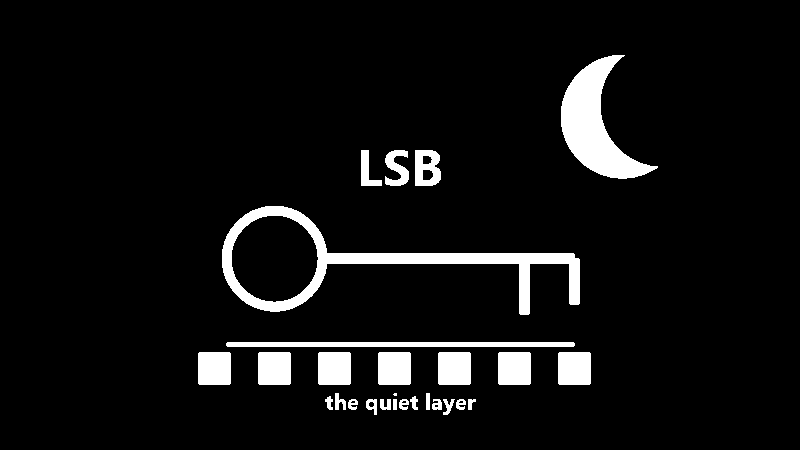

I like **steganography** because it feels *sneaky in a very gentle way*.

**Cryptography** says: "I have a message, but you cannot read it." **Steganography** says: "*Message? What message?*" It is the art of hiding **the existence of the message itself**. Not a locked box, exactly. More like a note folded into the wallpaper.

The little color story that started this article is beautifully simple: one **pixel** is <span class="inline-yellow">yellow</span>, another pixel is <span class="inline-green">green</span>, and if we borrow only the *tiny parts* of the green pixel that the eye barely notices, the yellow still looks yellow. But the green leaves a trace. <span class="inline-quiet">Quiet</span>, but there.

That is the whole mood of steganography. The <span class="inline-secret">secret</span> does not shout. It just moves into the **least suspicious place in the room**.

## A Short History of Hiding in Plain Sight

### The Message "Under the Surface"

One of the oldest stories in history is the story of the Greek ruler **Histiaeus**, who was trapped and wanted to send a secret message for a military revolt. What did he do? He brought his trusted servant, shaved his head completely, and tattooed the message on his scalp! He waited a few weeks until the hair grew back and covered the tattoo, then sent him off. The messenger passed through all the guards and checkpoints like an ordinary traveler carrying no paper at all. The message was not encrypted. It was literally hidden "under the surface".

### Secrets Hidden in Knitting Stitches

And if we want a less ancient example, during World War II, spies, especially women, used knitting to hide dangerous military messages and details about train movements! You would look at the sweater or shawl and think it was just a normal piece of clothing, but the type of stitch and its order formed **Morse code**. The secret was hiding in the middle of the room, visible to everyone, but no one suspected it.

### The Paper That Changes Its Mind

Then, of course, came the era of invisible inks: lemon juice, hidden ink, and chemicals. All those little activities we used to do as kids, getting excited when a blank page suddenly changed and gave away its secret when we exposed it to heat or certain kinds of light. All of these were ways of hiding information without realizing it.

### The Digital Age: Hiding Inside "Noise"

And when we entered the age of computers, technology opened doors to new places where we could hide messages: **noise**.

The digital images we see every day are full of extremely fine details and color gradients. To the computer, an image is just numbers, but our eyes interpret them as colors. That is why today we can hide information inside a digital image, and that is what we are going to explore today.

## Pixels and Hex Without the Headache

A **pixel** is one tiny spot of color in a digital image. More precisely, it is the smallest part of the image that the computer can point to and give a color. A photo is just a huge grid of these tiny spots. One pixel alone does not say much, but when millions of pixels sit next to each other, your eye blends them into a face, a street, a sky, or a cat doing something suspicious.


*From far away, your eye blends all those tiny color decisions into one smooth image. Up close, the picture turns back into little squares with numbers behind them.*

Most digital colors are stored as three color channels: <span class="inline-red">red</span>, <span class="inline-green">green</span>, and <span class="inline-blue">blue</span>. You will often see that written as <span class="inline-red">R</span><span class="inline-green">G</span><span class="inline-blue">B</span>. Each channel is a number that says how much of that color of light is in the pixel.

Each channel usually goes from `0` to `255`. **Zero** means none of that color. `255` means that channel is fully on. So one pixel is simply three channel values sitting next to each other:


**Hex** is the same color written in a shorter format. Hex counts `0` through `9`, then `A` through `F`, so one color channel fits into two hex digits from `00` to `FF`.

Start with decimal RGB values: `255, 195, 89`.

Turn each channel into a two-digit hex pair: `255 -> FF`, `195 -> C3`, `89 -> 59`.

Then place the three pairs side by side and add `#`: `#FFC359`.

That is all `#RRGGBB` means: one pair for <span class="inline-red">red</span>, one for <span class="inline-green">green</span>, and one for <span class="inline-blue">blue</span>.

You do not need to calculate it in your head every time. The only important idea here is this: each color channel has a <span class="inline-loud">loud part</span> and a <span class="inline-quiet">quiet part</span>. Steganography likes the <span class="inline-quiet">quiet part</span>.

Here is a more playful way to see it. **Move around the pixel field.** The big **hex code** updates from the square under the lens, and the bit rows show how every color channel is really *eight little on/off decisions*.

```html-live
<!-- sandbox-height: 500 -->
<style>
  body {
    min-height: 100vh;
    margin: 0;
    padding: 24px 16px;
    background: #0f1012;
    color: #e0e0e0;
    font-family: "Roboto Flex", system-ui, sans-serif;
    display: flex;
    justify-content: center;
    align-items: center;
    overflow: hidden;
  }

  .lab {
    width: 100%;
    max-width: 900px;
    display: flex;
    gap: 48px;
    align-items: center;
    justify-content: center;
  }

  .stage {
    flex: 1.2;
    position: relative;
    max-width: 520px;
  }

  canvas {
    width: 100%;
    height: auto;
    aspect-ratio: 16 / 9;
    background:
      radial-gradient(circle at top left, rgba(255, 196, 87, 0.12), transparent 34%),
      radial-gradient(circle at bottom right, rgba(255, 126, 62, 0.1), transparent 40%),
      #0f1012;
    border-radius: 18px;
    border: 1px solid rgba(255,255,255,0.12);
    box-shadow:
      inset 0 1px 0 rgba(255,255,255,0.06),
      0 18px 48px rgba(0,0,0,0.55);
    cursor: crosshair;
    touch-action: none;
    user-select: none;
    -webkit-user-select: none;
  }

  .formulas {
    flex: 0.8;
    display: flex;
    flex-direction: column;
    gap: 28px;
    font-family: "Courier New", Courier, monospace;
    font-size: 18px;
  }

  .hex-title {
    font-size: 42px;
    font-weight: bold;
    color: #fff;
    letter-spacing: 2px;
    margin-bottom: 0px;
  }

  .channel {
    display: flex;
    align-items: center;
    gap: 16px;
  }

  .ch-name {
    width: 18px;
    font-weight: bold;
  }

  .ch-val {
    width: 36px;
    text-align: right;
    color: #888;
  }

  .ch-hex {
    width: 30px;
    text-align: center;
    font-weight: bold;
  }

  .bits {
    display: flex;
    gap: 6px;
    margin-left: 12px;
  }

  .bit {
    font-size: 15px;
    color: #333;
    transition: color 0.15s ease-out, transform 0.2s cubic-bezier(0.2, 0.9, 0.3, 1.3);
  }

  .bit.on {
    transform: translateY(-2px);
  }

  .r-row .ch-name, .r-row .ch-hex, .r-row .bit.on { color: #ff7a70; text-shadow: 0 0 12px rgba(255,122,112,0.34); }
  .g-row .ch-name, .g-row .ch-hex, .g-row .bit.on { color: #9be26a; text-shadow: 0 0 12px rgba(155,226,106,0.28); }
  .b-row .ch-name, .b-row .ch-hex, .b-row .bit.on { color: #78cfff; text-shadow: 0 0 12px rgba(120,207,255,0.28); }

  @media (max-width: 760px) {
    .lab {
      flex-direction: column;
      gap: 36px;
      padding: 0;
    }
    .hex-title {
      font-size: 32px;
      text-align: center;
    }
    .formulas {
      font-size: 14px;
      width: 100%;
      align-items: center;
      gap: 20px;
    }
    .channel {
      gap: 12px;
    }
    .bits {
      margin-left: 4px;
      gap: 4px;
    }
  }
</style>

<div class="lab" dir="ltr">
  <div class="stage">
    <canvas id="pixel-canvas" width="600" height="340"></canvas>
  </div>
  <div class="formulas">
    <div id="hex-view" class="hex-title">#000000</div>
    <div id="ch-r" class="channel r-row"><div class="ch-name">R</div><div class="ch-val">0</div><div class="ch-hex">00</div><div class="bits"></div></div>
    <div id="ch-g" class="channel g-row"><div class="ch-name">G</div><div class="ch-val">0</div><div class="ch-hex">00</div><div class="bits"></div></div>
    <div id="ch-b" class="channel b-row"><div class="ch-name">B</div><div class="ch-val">0</div><div class="ch-hex">00</div><div class="bits"></div></div>
  </div>
</div>

<script>
  const canvas = document.getElementById('pixel-canvas');
  const ctx = canvas.getContext('2d');
  const cols = 20;
  const rows = 12;
  
  // Setup HTML bit structures
  ['r', 'g', 'b'].forEach(ch => {
    const bitsEl = document.querySelector(`#ch-${ch} .bits`);
    for(let i=0; i<8; i++) {
        const bit = document.createElement('div');
        bit.className = 'bit';
        bit.textContent = '0';
        bitsEl.appendChild(bit);
    }
  });

  function clamp(val, min, max) { return Math.max(min, Math.min(max, val)); }
  function toHex(val) { return Math.round(val).toString(16).padStart(2, '0').toUpperCase(); }
  function mix(a, b, t) { return a + (b - a) * t; }
  function blendColor(colorA, colorB, t) {
    return colorA.map((value, index) => mix(value, colorB[index], t));
  }
  
  function pixelColor(col, row) {
    const x = col / (cols - 1);
    const y = row / (rows - 1);

    const topLeft = [248, 214, 112];
    const topRight = [255, 168, 74];
    const bottomLeft = [88, 29, 146];
    const bottomRight = [129, 37, 183];

    const topBand = blendColor(topLeft, topRight, x);
    const bottomBand = blendColor(bottomLeft, bottomRight, x);
    let rgb = blendColor(topBand, bottomBand, y);

    const centerGlow = Math.max(0, 1 - Math.hypot(x - 0.5, y - 0.64) / 0.78);
    rgb = blendColor(rgb, [204, 58, 160], centerGlow * 0.46);

    const orangeBloom = Math.max(0, 1 - Math.hypot(x - 0.2, y - 0.24) / 0.5);
    rgb = blendColor(rgb, [255, 137, 62], orangeBloom * 0.2);

    const yellowBloom = Math.max(0, 1 - Math.hypot(x - 0.78, y - 0.12) / 0.42);
    rgb = blendColor(rgb, [255, 232, 109], yellowBloom * 0.18);

    const wave = Math.sin(x * 4.2 - y * 2.4) * 13 + Math.cos(y * 4.9 + x * 1.3) * 8;
    rgb = rgb.map((value, index) => value + wave * [0.72, 0.22, 0.62][index]);

    if (col === 5 && row === 4) rgb = [255, 0, 0];
    if (col === 14 && row === 7) rgb = [0, 255, 0];
    if (col === 17 && row === 3) rgb = [0, 0, 255];
    
    return rgb.map(v => clamp(v, 0, 255));
  }

  const pixels = Array.from({length: rows}, (_, r) => 
    Array.from({length: cols}, (_, c) => pixelColor(c, r))
  );

  let target = {col: 5, row: 4};
  let focus = {col: 5, row: 4};
  let lastColorStr = '';
  let activePointerId = null;

  function updateMath(rgb) {
    const hex = '#' + rgb.map(toHex).join('');
    document.getElementById('hex-view').textContent = hex;
    
    ['r', 'g', 'b'].forEach((ch, idx) => {
      const val = Math.round(rgb[idx]);
      const rowEl = document.getElementById(`ch-${ch}`);
      rowEl.querySelector('.ch-val').textContent = val;
      rowEl.querySelector('.ch-hex').textContent = toHex(val);
      
      const bitStr = val.toString(2).padStart(8, '0');
      const bitNodes = rowEl.querySelector('.bits').children;
      for(let i=0; i<8; i++) {
         bitNodes[i].textContent = bitStr[i];
         if(bitStr[i] === '1') bitNodes[i].classList.add('on');
         else bitNodes[i].classList.remove('on');
      }
    });
  }

  function setTargetFromPointer(e) {
    const rect = canvas.getBoundingClientRect();
    const x = (e.clientX - rect.left) / rect.width;
    const y = (e.clientY - rect.top) / rect.height;
    target.col = clamp(Math.floor(x * cols), 0, cols - 1);
    target.row = clamp(Math.floor(y * rows), 0, rows - 1);
  }

  canvas.addEventListener('pointermove', e => {
    if (e.pointerType === 'touch' && activePointerId !== e.pointerId) return;
    setTargetFromPointer(e);
  });
  canvas.addEventListener('pointerdown', e => {
     activePointerId = e.pointerId;
     setTargetFromPointer(e);
     canvas.setPointerCapture(e.pointerId);
     e.preventDefault();
  });
  canvas.addEventListener('pointerup', e => {
     if (activePointerId === e.pointerId) activePointerId = null;
  });
  canvas.addEventListener('pointercancel', e => {
     if (activePointerId === e.pointerId) activePointerId = null;
  });
  canvas.addEventListener('lostpointercapture', () => {
     activePointerId = null;
  });

  function drawGrid(scalePass) {
    const cellW = canvas.width / cols;
    const cellH = canvas.height / rows;
    for (let row = 0; row < rows; row++) {
      for (let col = 0; col < cols; col++) {
        ctx.fillStyle = '#' + pixels[row][col].map(toHex).join('');
        ctx.fillRect(col * cellW, row * cellH, cellW + 1, cellH + 1);
        if (!scalePass) {
          ctx.strokeStyle = 'rgba(27, 18, 40, 0.14)';
          ctx.lineWidth = 1;
          ctx.strokeRect(col * cellW, row * cellH, cellW, cellH);
        }
      }
    }
  }

  function draw() {
    focus.col += (target.col - focus.col) * 0.15;
    focus.row += (target.row - focus.row) * 0.15;
    
    ctx.clearRect(0, 0, canvas.width, canvas.height);
    drawGrid(false);

    const cellW = canvas.width / cols;
    const cellH = canvas.height / rows;
    const cx = (focus.col + 0.5) * cellW;
    const cy = (focus.row + 0.5) * cellH;

    ctx.save();
    ctx.beginPath();
    ctx.arc(cx, cy, 65, 0, Math.PI * 2);
    ctx.clip();
    
    ctx.translate(cx, cy);
    ctx.scale(2.8, 2.8);
    ctx.translate(-cx, -cy);
    drawGrid(true);
    ctx.restore();

    ctx.beginPath();
    ctx.arc(cx, cy, 65, 0, Math.PI * 2);
    ctx.strokeStyle = 'rgba(255,225,53,0.9)';
    ctx.lineWidth = 2;
    ctx.setLineDash([4, 4]);
    ctx.stroke();
    
    ctx.setLineDash([]);
    ctx.strokeStyle = 'rgba(255, 242, 186, 0.96)';
    ctx.lineWidth = 1.5;
    ctx.strokeRect(target.col * cellW + 2, target.row * cellH + 2, cellW - 4, cellH - 4);

    const sc = clamp(Math.round(focus.col), 0, cols - 1);
    const sr = clamp(Math.round(focus.row), 0, rows - 1);
    const pColor = pixels[sr][sc];
    const cStr = pColor.join();
    if (cStr !== lastColorStr) {
      updateMath(pColor);
      lastColorStr = cStr;
    }

    requestAnimationFrame(draw);
  }

  updateMath(pixels[target.row][target.col]);
  draw();
</script>
```

## How To Hide A Pixel Inside A Pixel!

Every pixel is made of color channels (red, green, blue), and each channel is represented by a number from `0` to `255`.
Inside the computer, that number is stored as **8 bits**. A bit is simply one binary slot (either $0$ or $1$).

The question here is: do all bits have the same importance?

To understand that, let’s go back to the math for a moment. Bits work on powers of 2 (that is, $2^x$).
The first bit (from the right) is worth $2^0 = 1$, the next is $2^1 = 2$, and so on until we reach the eighth bit, which is worth $2^7 = 128$.

$$
\begin{array}{cccccccc}
2^7 & 2^6 & 2^5 & 2^4 & 2^3 & 2^2 & 2^1 & 2^0 \\
\mathbf{128} & \mathbf{64} & \mathbf{32} & \mathbf{16} & \mathbf{8} & \mathbf{4} & \mathbf{2} & \mathbf{1}
\end{array}
$$

If we split the 8 bits into two halves:
- **The Strong Half (Most Significant Bits):** These are the 4 bits on the left. Their values are the big numbers ($128, 64, 32, 16$). This half is what mainly defines the **identity of the color**.
- **The Quiet Half (Least Significant Bits):** These are the 4 bits on the right. Their values are tiny ($8, 4, 2, 1$). If we add them all up, they give us only $15$ out of $255$! That means their effect on the color does not exceed about $6\%$, and changing them creates such a tiny difference that the human eye usually does not notice it.

In other words, the quiet half (the 4 weak bits) can be treated as **empty space** or a “secret room” that we can use.

### The Trick: Merge Two Colors Into One Pixel

To hide a <span class="inline-secret">secret pixel</span> inside a <span class="inline-carrier">cover pixel</span>, we do this:
1. We clear the quiet half of the **cover pixel** (because its effect is almost negligible).
2. We take the strong half of the **secret pixel** (because it carries the most important information about the secret color).
3. We place that strong half from the secret pixel where the quiet half used to be in the cover pixel.

The result is a **carrier pixel** that still looks very close to the cover pixel, but secretly contains the hidden data.

Let’s see it as a diagram:

```tikz
\begin{tikzpicture}[font=\sffamily, every node/.style={align=center}]
  \node[draw=yellow, text=yellow, rounded corners=6pt, minimum width=3.8cm, minimum height=1.2cm, thick] (cover) at (0, 2) {\textbf{Cover Pixel}\\ \small \texttt{1111} \textcolor{gray}{\texttt{1111}}};
  
  \node[draw=green, text=green, rounded corners=6pt, minimum width=3.8cm, minimum height=1.2cm, thick] (secret) at (0, -2) {\textbf{Secret Pixel}\\ \small \texttt{1000} \textcolor{gray}{\texttt{1111}}};
  
  \node[draw=orange, text=orange, rounded corners=6pt, minimum width=4.2cm, minimum height=1.4cm, thick] (carrier) at (6, 0) {\textbf{Carrier Pixel}\\ \small \texttt{1111} \textcolor{green}{\texttt{1000}}};

  \draw[->, thick, yellow, shorten >=2pt] (cover.east) .. controls (3, 2) and (3, 0.5) .. (carrier.west) node[midway, above=4pt, sloped] {\small Keep the strong half};
  
  \draw[->, thick, green, dashed, shorten >=2pt] (secret.east) .. controls (3, -2) and (3, -0.5) .. (carrier.west) node[midway, below=4pt, sloped] {\small Hide the strong half};
\end{tikzpicture}
```

Let’s make it concrete: take this <span class="inline-yellow">yellow</span> as the cover, and this <span class="inline-green">green</span> as the secret.
If we apply that bitwise logic, this is the flow. Try following it yourself below and watch how the colors merge and separate:

```html-live
<!-- sandbox-height: 480 -->
<style>
  :root { color-scheme: dark; }
  body {
    min-height: 100vh; margin: 0; padding: 24px;
    background: #0f1012; color: #fff;
    font-family: "Inter", "Roboto Flex", system-ui, sans-serif;
    display: flex; justify-content: center; align-items: center;
  }
  .sleek-lab {
    width: 100%; max-width: 900px; position: relative;
    padding: 32px; border-radius: 32px;
    background: transparent;
    border: 1px solid rgba(255,255,255,0.05);
    overflow: hidden;
  }
  .top-bar { display: flex; justify-content: space-between; align-items: flex-end; margin-bottom: 40px; }
  .subtitle { font-size: 11px; letter-spacing: 0.2em; color: #58c4dd; text-transform: uppercase; margin-bottom: 8px; font-weight: 600; }
  h2 { margin: 0; font-size: 28px; font-weight: 300; letter-spacing: -0.02em; }
  button {
    background: transparent; border: 1px solid rgba(255,255,255,0.2); color: #fff;
    padding: 10px 20px; border-radius: 999px; cursor: pointer; font-family: inherit; font-size: 12px; text-transform: uppercase; letter-spacing: 0.1em;
    transition: all 0.3s ease;
  }
  button:hover { background: #fff; color: #000; }
  
  .data-flow { display: flex; flex-direction: column; gap: 24px; }
  .channel-row {
    display: grid; grid-template-columns: 40px repeat(4, 1fr); align-items: center; gap: 16px;
    padding-bottom: 24px; border-bottom: 1px solid rgba(255,255,255,0.05);
  }
  .channel-row:last-child { border-bottom: none; padding-bottom: 0; }
  .ch-label { font-size: 24px; font-weight: bold; color: var(--color); text-shadow: 0 0 15px var(--color); text-align: center; }
  .byte-group { display: flex; flex-direction: column; align-items: center; gap: 6px; }
  .b-label { font-size: 10px; color: rgba(255,255,255,0.4); text-transform: uppercase; letter-spacing: 0.1em; }
  .byte { font-family: "JetBrains Mono", monospace; font-size: 32px; font-weight: 300; color: rgba(255,255,255,0.15); display: flex; gap: 6px; }
  .byte span { transition: all 0.5s cubic-bezier(0.4, 0, 0.2, 1); display: inline-block; }
  
  .r-chan { --color: #ff5f58; }
  .g-chan { --color: #28c940; }
  .b-chan { --color: #2da1ff; }

  .sleek-lab[data-step="0"] .cover .h1 { color: #fff; font-weight: 700; text-shadow: 0 0 15px rgba(255,255,255,0.6); transform: translateY(-3px); }
  
  .sleek-lab[data-step="1"] .cover .h1 { color: #fff; }
  .sleek-lab[data-step="1"] .secret .h1 { color: var(--color); font-weight: 700; text-shadow: 0 0 15px var(--color); transform: translateY(-3px); }
  
  .sleek-lab[data-step="2"] .carrier .h1 { color: #fff; font-weight: 700; }
  .sleek-lab[data-step="2"] .carrier .h2 { color: var(--color); font-weight: 700; text-shadow: 0 0 15px var(--color); transform: translateY(-2px) scale(1.05); }
  
  .sleek-lab[data-step="3"] .carrier .h1 { color: #fff; }
  .sleek-lab[data-step="3"] .carrier .h2 { color: var(--color); }
  .sleek-lab[data-step="3"] .reveal .h1 { color: var(--color); font-weight: 700; text-shadow: 0 0 15px var(--color); transform: translateY(-3px); }
  
  .message-box {
    margin-top: 32px; font-size: 15px; line-height: 1.6; color: rgba(255,255,255,0.7); text-align: center;
    min-height: 48px; display: flex; align-items: center; justify-content: center;
  }

  @media (max-width: 760px) {
    .sleek-lab { padding: 24px 16px; border-radius: 20px; }
    .channel-row { grid-template-columns: 1fr; gap: 24px; padding-bottom: 32px; position: relative; }
    .ch-label { position: absolute; top: 0; left: 16px; font-size: 20px; }
    .byte-group { display: grid; grid-template-columns: 80px 1fr; align-items: center; justify-items: start; gap: 16px; width: 100%; padding-left: 48px; box-sizing: border-box; }
    .b-label { text-align: left; }
    .byte { font-size: 28px; }
    .top-bar { flex-direction: column; align-items: flex-start; gap: 16px; }
  }
</style>

<div class="sleek-lab" id="eng-lab" data-step="0">
  <div class="top-bar">
    <div>
      <div class="subtitle">Hide & Extract</div>
      <h2>Pixel Merge Engine</h2>
    </div>
    <button id="eng-replay">Replay</button>
  </div>
  
  <div class="data-flow">
     <div class="channel-row r-chan">
        <div class="ch-label">R</div>
        <div class="byte-group cover"><div class="b-label">Cover</div><div class="byte"><span class="h1">F</span><span class="h2">F</span></div></div>
        <div class="byte-group secret"><div class="b-label">Secret</div><div class="byte"><span class="h1">8</span><span class="h2">F</span></div></div>
        <div class="byte-group carrier"><div class="b-label">Carrier</div><div class="byte"><span class="h1">F</span><span class="h2">8</span></div></div>
        <div class="byte-group reveal"><div class="b-label">Reveal</div><div class="byte"><span class="h1">8</span><span class="h2">0</span></div></div>
     </div>
     <div class="channel-row g-chan">
        <div class="ch-label">G</div>
        <div class="byte-group cover"><div class="b-label">Cover</div><div class="byte"><span class="h1">C</span><span class="h2">3</span></div></div>
        <div class="byte-group secret"><div class="b-label">Secret</div><div class="byte"><span class="h1">C</span><span class="h2">5</span></div></div>
        <div class="byte-group carrier"><div class="b-label">Carrier</div><div class="byte"><span class="h1">C</span><span class="h2">C</span></div></div>
        <div class="byte-group reveal"><div class="b-label">Reveal</div><div class="byte"><span class="h1">C</span><span class="h2">0</span></div></div>
     </div>
     <div class="channel-row b-chan">
        <div class="ch-label">B</div>
        <div class="byte-group cover"><div class="b-label">Cover</div><div class="byte"><span class="h1">5</span><span class="h2">9</span></div></div>
        <div class="byte-group secret"><div class="b-label">Secret</div><div class="byte"><span class="h1">6</span><span class="h2">C</span></div></div>
        <div class="byte-group carrier"><div class="b-label">Carrier</div><div class="byte"><span class="h1">5</span><span class="h2">6</span></div></div>
        <div class="byte-group reveal"><div class="b-label">Reveal</div><div class="byte"><span class="h1">6</span><span class="h2">0</span></div></div>
     </div>
  </div>
  
  <div class="message-box" id="eng-msg"></div>
</div>

<script>
  const engLab = document.getElementById('eng-lab');
  const engMsg = document.getElementById('eng-msg');
  const engSteps = [
    "Step 1: Keep the strong half (the left 4 bits) of the cover pixel, because that is the part the eye mainly reads as the color.",
    "Step 2: Take the strong half of the secret pixel so its overall shape survives, and ignore its quiet half.",
    "Step 3: Merge the strong half from the secret into the quiet space of the cover. Result: a carrier pixel with a barely noticeable change.",
    "Step 4: To extract the secret, read the quiet half from the carrier pixel and shift it back to the left so it becomes the strong half again."
  ];
  let engTimers = [];

  function setEngStep(step) {
    engLab.dataset.step = String(step);
    engMsg.style.opacity = 0;
    setTimeout(() => {
      engMsg.textContent = engSteps[step];
      engMsg.style.opacity = 1;
    }, 200);
  }

  function playEng() {
    engTimers.forEach(clearTimeout);
    engTimers = [];
    setEngStep(0);
    [1, 2, 3].forEach((step, index) => {
      engTimers.push(setTimeout(() => setEngStep(step), (index + 1) * 1400));
    });
  }

  document.getElementById('eng-replay').addEventListener('click', playEng);
  engMsg.style.transition = 'opacity 0.2s';
  setEngStep(0);
  setTimeout(playEng, 400);
</script>
```

The nicest thing about this example is that it is **not dramatic**. The image does not suddenly look broken. It does not scream "<span class="inline-secret">there is a secret here</span>". It just changes a few *small numbers*, and bets that the eye will ignore them.

That is also why we should be careful: steganography by itself is **not always security**. If someone suspects it, they can inspect it. In real security, we often combine it with **encryption**: first make the message itself unreadable, then hide it in a boring place.

## Same Old Instinct, New Places

The <span class="inline-carrier">carrier</span> keeps changing. The instinct stays the same.

```html-live
<!-- sandbox-height: 280 -->
<style>
  body {
    min-height: 100vh;
    margin: 0;
    padding: 24px;
    background: #0f1012;
    color: #e0e0e0;
    font-family: "Roboto Flex", system-ui, sans-serif;
    display: flex;
    justify-content: center;
    align-items: center;
  }
  .timeline {
    width: 100%;
    max-width: 800px;
    display: flex;
    gap: 40px;
    align-items: center;
    justify-content: space-between;
    position: relative;
  }
  .timeline::before {
    content: '';
    position: absolute;
    top: 50%;
    left: 40px;
    right: 40px;
    height: 2px;
    background: rgba(255,255,255,0.1);
    z-index: 0;
  }
  .node {
    position: relative;
    z-index: 1;
    display: flex;
    flex-direction: column;
    align-items: center;
    gap: 16px;
    text-align: center;
    width: 120px;
  }
  .circle {
    width: 20px;
    height: 20px;
    border-radius: 50%;
    background: #0f1012;
    border: 2px solid #58c4dd;
    position: relative;
  }
  .circle.active {
    background: #58c4dd;
    box-shadow: 0 0 15px rgba(88,196,221,0.6);
  }
  .label { font-weight: 600; color: #fff; font-size: 15px; }
  .desc { font-size: 12px; color: #888; }
  
  .packet {
    position: absolute;
    top: 50%;
    left: 40px;
    transform: translate(-50%, -50%);
    width: 8px;
    height: 8px;
    border-radius: 50%;
    background: #E8C170;
    box-shadow: 0 0 12px #E8C170;
    z-index: 2;
    animation: travel 8s ease-in-out infinite;
  }

  @keyframes travel {
    0%, 15% { left: calc(0% + 60px); opacity: 0; }
    20% { left: calc(0% + 60px); opacity: 1; }
    40%, 45% { left: calc(33.33% + 20px); }
    60%, 65% { left: calc(66.66% - 20px); }
    85%, 100% { left: calc(100% - 60px); opacity: 1; }
  }

  @media (max-width: 760px) {
    .timeline {
      flex-direction: column;
      align-items: flex-start;
      gap: 32px;
    }
    .timeline::before {
      top: 40px;
      bottom: 40px;
      left: 10px;
      width: 2px;
      height: auto;
      right: auto;
    }
    .node {
      flex-direction: row;
      text-align: left;
      width: 100%;
      height: 40px;
      gap: 24px;
    }
    .circle { flex-shrink: 0; }
    .label { width: 80px; }
    .packet {
      top: 40px;
      left: 10px;
      animation: travel-v 8s ease-in-out infinite;
    }
    @keyframes travel-v {
      0%, 15% { top: 20px; opacity: 0; }
      20% { top: 20px; opacity: 1; }
      40%, 45% { top: calc(33.33% + 5px); }
      60%, 65% { top: calc(66.66% - 5px); }
      85%, 100% { top: calc(100% - 20px); opacity: 1; }
    }
  }
</style>

<div class="timeline" dir="ltr">
  <div class="packet"></div>
  <div class="node"><div class="circle"></div><div class="label">Wax</div><div class="desc">A blank tablet</div></div>
  <div class="node"><div class="circle"></div><div class="label">Ink</div><div class="desc">Heat turns visible</div></div>
  <div class="node"><div class="circle"></div><div class="label">Microdot</div><div class="desc">Shrinks into speck</div></div>
  <div class="node"><div class="circle"></div><div class="label">Pixels</div><div class="desc">Noise hiding place</div></div>
</div>
```

The digital version feels modern, but it is really an ancient habit wearing new clothes. Find a surface. Find the part people are trained not to question. Hide there.

## My Tiny Experiment

For the ending, I made a **real carrier image**. I took a normal photograph from my own gallery, then made a small black-and-white <span class="inline-secret">hidden image</span>. I embedded that hidden image in the <span class="inline-quiet">least significant bit</span> of the carrier photo's color channels.

The <span class="inline-carrier">carrier</span> still looks like a normal street photo. The hidden image is **not pasted on top of it**. It is distributed across the pixels as tiny *one-bit decisions*.

This is the <span class="inline-secret">hidden layer</span> after extracting those lowest bits:



And this is the real image that carries it:


===AR===

أنا معجب بفن **إخفاء المعلومات (الستيغانوغرافي - Steganography)**، لأنه بحسه *خبيث بس بطريقة كتير لطيفة*.

**التشفير (Cryptography)** بحكيلك: "أنا عندي رسالة، بس إنت ما بتقدر تقرأها".

أما **إخفاء المعلومات** بحكيلك: "*رسالة؟ أي رسالة؟*"

فهو فن إنك تخفي **وجود الرسالة من الأساس**. يعني هو مش مثل صندوق مسكّر بقفل بالضبط، بل أقرب لورقة صغيرة مطوية ومخباية بورق زينة.

قصة الألوان الصغيرة اللي بلّش فيها هالمقال حلوة وبسيطة كتير: **بيكسل** لونه <span class="inline-yellow">أصفر</span>، وبيكسل تاني لونه <span class="inline-green">أخضر</span>، وإذا أخدنا بس *الأجزاء الصغيرة كتير* من البيكسل الأخضر اللي العين يا دوب بتلاحظها، الأصفر بضل مبيّن أصفر. بس الأخضر بيترك أثر. أثر <span class="inline-quiet">هادي</span>، بس موجود.

هاد هو بالضبط الجوهر تبع إخفاء المعلومات. <span class="inline-secret">السر</span> ما بيصيّح ولا بيلفت الانتباه. هو بس بيروح بيقعد **بأقل مكان ممكن يثير الشك بالغرفة**.

## تاريخ قصير للإخفاء في وضح البصر

### الرسالة اللي "تحت السطح"

من أقدم القصص بالتاريخ، قصة الحاكم اليوناني **هيستيايوس** اللي كان محاصر وبده يبعث رسالة سرية لتمرد عسكري. شو عمل؟ جاب خادمه الموثوق، حلقله شعر راسه على الصفر، ووشم الرسالة على فروة راسه! استنى كم أسبوع لحد ما الشعر رجع طول وغطى الوشم، وبعثه. المرسال مرّ من كل الحراس ونقاط التفتيش كأنه مجرد شخص مسافر ما معه أي ورقة. الرسالة ما كانت مشفرة، كانت حرفياً مخبية "تحت السطح".

### أسرار مخبية بغرز الصوف

وإذا بدنا مثال مش من فترة، فخلال الحرب العالمية الثانية، الجواسيس (وخاصة النساء) كانوا يخفوا رسائل عسكرية خطيرة وتفاصيل عن حركة القطارات من خلال حياكة الصوف! تتطلع على الكنزة أو الشال تفكره قطعة ملابس عادية، بس نوع الغرزة وترتيبها كان عبارة عن شيفرة "**مورس**". السر كان متخفي بنص الغرفة ومكشوف للكل، بس ولا حدا شك فيه.

### الورق اللي بيغير رأيه

بعدين طبعاً إجت فترة الأحبار المخفية: عصير الليمون، الحبر المخفي، والمواد الكيميائية.. كل هالفعاليات اللي كنا نعملها وإحنا صغار ونكيف لما الورقة الفاضية تتغير فجأة وتفضح سرها لما نعرضها للحرارة أو اشعة معينة. كل هاي طرق كنا نخفي فيها معلومات بدون ما ندرك.

### العصر الرقمي: الاختباء جوا "الضجيج"

ولما دخلنا عصر الكمبيوترات، التكنولوجيا فتحتلنا أبواب لمحلات جديدة نخبي فيها رسائل: **الضجيج (Noise)**.

الصور الرقمية اللي بنشوفها كل يوم مليانة تفاصيل ودرجات ألوان دقيقة جداً. بالنسبة للكمبيوتر الصورة مجرد ارقام ولكن عيوننا بتترجمها لالوان. لهيك اليوم أصبح بإمكاننا نخفي معلومات داخل صورة رقمية وهاذ يلي رح نتناوله اليوم.

## البكسلات والـ hex ببساطة

البكسل هو نقطة الها لون صغيرة جداً في الصورة الرقمية. أو بمعنى أدق، هو أصغر جزء بالصورة الكمبيوتر بقدر يحدده ويعطيه لون. الصورة كلها شبكة كبيرة من هاي النقاط الصغيرة. البكسل لحاله ما بحكي إشي، بس لما ملايين البكسلات تيجي وتصطف جنب بعض، عينك بتمزجهم وبتشوف وجه، شارع، سما، أو بسّة عاملة كركبة.


*من بعيد عينك بتخلط كل اشعة اللون الصغيرة وبتشوف صورة منسجمة. من قريب، الصورة بترجع مربعات صغيرة وخلف كل مربع أرقام.*

أغلب الألوان الرقمية بتنحفظ في ثلاث قنوات لون: <span class="inline-red">أحمر</span>، <span class="inline-green">أخضر</span>، <span class="inline-blue">أزرق</span>. غالبا بنكتبهم <span class="inline-red">R</span><span class="inline-green">G</span><span class="inline-blue">B</span>. كل قناة هي رقم بحكي قديش في من هاللون الضوئي داخل البكسل.

كل قناة عادة بتمشي من `0` لـ `255`. **صفر** يعني ما في من هاللون. `255` يعني هاذ الون متواجد بشدة (**ماكسيموم**). يعني البكسل الواحد هو ببساطة ثلاث قيم لون جنب بعض:


**الـ hex** هو نفس اللون بس مكتوب بصيغة أقصر. بالـ hex العد بكمّل بعد `9` بـ `A` لحد `F`، وعشان هيك كل قناة لون بتنكتب برقمين من `00` لحد `FF`.

ابدأ من قيم RGB العشرية: `255, 195, 89`.

حوّل كل قناة لزوج hex: `255 -> FF`، `195 -> C3`، `89 -> 59`.

بعدين حط الأزواج جنب بعض وحط `#` بالبداية: `#FFC359`.

يعني `#RRGGBB` بكل بساطة: زوج <span class="inline-red">للأحمر</span>، زوج <span class="inline-green">للأخضر</span>، وزوج <span class="inline-blue">للأزرق</span>.

ومش لازم تحسبها براسك كل مرة. الفكرة المهمة من هون بس: انو كل قناة لون إلها <span class="inline-loud">جزء صوته عالي</span> وجزء <span class="inline-quiet">صوته واطي</span>. الستيغانوغرافي بتعشق <span class="inline-quiet">الجزء الواطي</span>.

وهون طريقة أوضح تشوفها بعينك وتستكشف. **حرّك العدسة داخل شبكة البكسلات.** كود الـ **hex** الكبير بتغيّر حسب المربع اللي تحت العدسة، وصفوف البِتّات بتورجيك كيف انو كل قناة لون هي فعلياً *ثماني قرارات on/off صغيرة*.

```html-live
<!-- sandbox-height: 500 -->
<style>
  body {
    min-height: 100vh;
    margin: 0;
    padding: 24px 16px;
    background: #0f1012;
    color: #e0e0e0;
    font-family: "Roboto Flex", system-ui, sans-serif;
    display: flex;
    justify-content: center;
    align-items: center;
    overflow: hidden;
  }

  .lab {
    width: 100%;
    max-width: 900px;
    display: flex;
    gap: 48px;
    align-items: center;
    justify-content: center;
  }

  .stage {
    flex: 1.2;
    position: relative;
    max-width: 520px;
  }

  canvas {
    width: 100%;
    height: auto;
    aspect-ratio: 16 / 9;
    background:
      radial-gradient(circle at top left, rgba(255, 196, 87, 0.12), transparent 34%),
      radial-gradient(circle at bottom right, rgba(255, 126, 62, 0.1), transparent 40%),
      #0f1012;
    border-radius: 18px;
    border: 1px solid rgba(255,255,255,0.12);
    box-shadow:
      inset 0 1px 0 rgba(255,255,255,0.06),
      0 18px 48px rgba(0,0,0,0.55);
    cursor: crosshair;
    touch-action: none;
    user-select: none;
    -webkit-user-select: none;
  }

  .formulas {
    flex: 0.8;
    display: flex;
    flex-direction: column;
    gap: 28px;
    font-family: "Courier New", Courier, monospace;
    font-size: 18px;
  }

  .hex-title {
    font-size: 42px;
    font-weight: bold;
    color: #fff;
    letter-spacing: 2px;
    margin-bottom: 0px;
  }

  .channel {
    display: flex;
    align-items: center;
    gap: 16px;
  }

  .ch-name {
    width: 18px;
    font-weight: bold;
  }

  .ch-val {
    width: 36px;
    text-align: right;
    color: #888;
  }

  .ch-hex {
    width: 30px;
    text-align: center;
    font-weight: bold;
  }

  .bits {
    display: flex;
    gap: 6px;
    margin-left: 12px;
  }

  .bit {
    font-size: 15px;
    color: #333;
    transition: color 0.15s ease-out, transform 0.2s cubic-bezier(0.2, 0.9, 0.3, 1.3);
  }

  .bit.on {
    transform: translateY(-2px);
  }

  .r-row .ch-name, .r-row .ch-hex, .r-row .bit.on { color: #ff7a70; text-shadow: 0 0 12px rgba(255,122,112,0.34); }
  .g-row .ch-name, .g-row .ch-hex, .g-row .bit.on { color: #9be26a; text-shadow: 0 0 12px rgba(155,226,106,0.28); }
  .b-row .ch-name, .b-row .ch-hex, .b-row .bit.on { color: #78cfff; text-shadow: 0 0 12px rgba(120,207,255,0.28); }

  @media (max-width: 760px) {
    .lab {
      flex-direction: column;
      gap: 36px;
      padding: 0;
    }
    .hex-title {
      font-size: 32px;
      text-align: center;
    }
    .formulas {
      font-size: 14px;
      width: 100%;
      align-items: center;
      gap: 20px;
    }
    .channel {
      gap: 12px;
    }
    .bits {
      margin-left: 4px;
      gap: 4px;
    }
  }
</style>

<div class="lab" dir="ltr">
  <div class="stage">
    <canvas id="pixel-canvas" width="600" height="340"></canvas>
  </div>
  <div class="formulas">
    <div id="hex-view" class="hex-title">#000000</div>
    <div id="ch-r" class="channel r-row"><div class="ch-name">R</div><div class="ch-val">0</div><div class="ch-hex">00</div><div class="bits"></div></div>
    <div id="ch-g" class="channel g-row"><div class="ch-name">G</div><div class="ch-val">0</div><div class="ch-hex">00</div><div class="bits"></div></div>
    <div id="ch-b" class="channel b-row"><div class="ch-name">B</div><div class="ch-val">0</div><div class="ch-hex">00</div><div class="bits"></div></div>
  </div>
</div>

<script>
  const canvas = document.getElementById('pixel-canvas');
  const ctx = canvas.getContext('2d');
  const cols = 20;
  const rows = 12;
  
  ['r', 'g', 'b'].forEach(ch => {
    const bitsEl = document.querySelector(`#ch-${ch} .bits`);
    for(let i=0; i<8; i++) {
        const bit = document.createElement('div');
        bit.className = 'bit';
        bit.textContent = '0';
        bitsEl.appendChild(bit);
    }
  });

  function clamp(val, min, max) { return Math.max(min, Math.min(max, val)); }
  function toHex(val) { return Math.round(val).toString(16).padStart(2, '0').toUpperCase(); }
  function mix(a, b, t) { return a + (b - a) * t; }
  function blendColor(colorA, colorB, t) {
    return colorA.map((value, index) => mix(value, colorB[index], t));
  }
  
  function pixelColor(col, row) {
    const x = col / (cols - 1);
    const y = row / (rows - 1);

    const topLeft = [248, 214, 112];
    const topRight = [255, 168, 74];
    const bottomLeft = [88, 29, 146];
    const bottomRight = [129, 37, 183];

    const topBand = blendColor(topLeft, topRight, x);
    const bottomBand = blendColor(bottomLeft, bottomRight, x);
    let rgb = blendColor(topBand, bottomBand, y);

    const centerGlow = Math.max(0, 1 - Math.hypot(x - 0.5, y - 0.64) / 0.78);
    rgb = blendColor(rgb, [204, 58, 160], centerGlow * 0.46);

    const orangeBloom = Math.max(0, 1 - Math.hypot(x - 0.2, y - 0.24) / 0.5);
    rgb = blendColor(rgb, [255, 137, 62], orangeBloom * 0.2);

    const yellowBloom = Math.max(0, 1 - Math.hypot(x - 0.78, y - 0.12) / 0.42);
    rgb = blendColor(rgb, [255, 232, 109], yellowBloom * 0.18);

    const wave = Math.sin(x * 4.2 - y * 2.4) * 13 + Math.cos(y * 4.9 + x * 1.3) * 8;
    rgb = rgb.map((value, index) => value + wave * [0.72, 0.22, 0.62][index]);

    if (col === 5 && row === 4) rgb = [255, 0, 0];
    if (col === 14 && row === 7) rgb = [0, 255, 0];
    if (col === 17 && row === 3) rgb = [0, 0, 255];
    
    return rgb.map(v => clamp(v, 0, 255));
  }

  const pixels = Array.from({length: rows}, (_, r) => 
    Array.from({length: cols}, (_, c) => pixelColor(c, r))
  );

  let target = {col: 5, row: 4};
  let focus = {col: 5, row: 4};
  let lastColorStr = '';
  let activePointerId = null;

  function updateMath(rgb) {
    const hex = '#' + rgb.map(toHex).join('');
    document.getElementById('hex-view').textContent = hex;
    
    ['r', 'g', 'b'].forEach((ch, idx) => {
      const val = Math.round(rgb[idx]);
      const rowEl = document.getElementById(`ch-${ch}`);
      rowEl.querySelector('.ch-val').textContent = val;
      rowEl.querySelector('.ch-hex').textContent = toHex(val);
      
      const bitStr = val.toString(2).padStart(8, '0');
      const bitNodes = rowEl.querySelector('.bits').children;
      for(let i=0; i<8; i++) {
         bitNodes[i].textContent = bitStr[i];
         if(bitStr[i] === '1') bitNodes[i].classList.add('on');
         else bitNodes[i].classList.remove('on');
      }
    });
  }

  function setTargetFromPointer(e) {
    const rect = canvas.getBoundingClientRect();
    const x = (e.clientX - rect.left) / rect.width;
    const y = (e.clientY - rect.top) / rect.height;
    target.col = clamp(Math.floor(x * cols), 0, cols - 1);
    target.row = clamp(Math.floor(y * rows), 0, rows - 1);
  }

  canvas.addEventListener('pointermove', e => {
    if (e.pointerType === 'touch' && activePointerId !== e.pointerId) return;
    setTargetFromPointer(e);
  });
  canvas.addEventListener('pointerdown', e => {
     activePointerId = e.pointerId;
     setTargetFromPointer(e);
     canvas.setPointerCapture(e.pointerId);
     e.preventDefault();
  });
  canvas.addEventListener('pointerup', e => {
     if (activePointerId === e.pointerId) activePointerId = null;
  });
  canvas.addEventListener('pointercancel', e => {
     if (activePointerId === e.pointerId) activePointerId = null;
  });
  canvas.addEventListener('lostpointercapture', () => {
     activePointerId = null;
  });

  function drawGrid(scalePass) {
    const cellW = canvas.width / cols;
    const cellH = canvas.height / rows;
    for (let row = 0; row < rows; row++) {
      for (let col = 0; col < cols; col++) {
        ctx.fillStyle = '#' + pixels[row][col].map(toHex).join('');
        ctx.fillRect(col * cellW, row * cellH, cellW + 1, cellH + 1);
        if (!scalePass) {
          ctx.strokeStyle = 'rgba(27, 18, 40, 0.14)';
          ctx.lineWidth = 1;
          ctx.strokeRect(col * cellW, row * cellH, cellW, cellH);
        }
      }
    }
  }

  function draw() {
    focus.col += (target.col - focus.col) * 0.15;
    focus.row += (target.row - focus.row) * 0.15;
    
    ctx.clearRect(0, 0, canvas.width, canvas.height);
    drawGrid(false);

    const cellW = canvas.width / cols;
    const cellH = canvas.height / rows;
    const cx = (focus.col + 0.5) * cellW;
    const cy = (focus.row + 0.5) * cellH;

    ctx.save();
    ctx.beginPath();
    ctx.arc(cx, cy, 65, 0, Math.PI * 2);
    ctx.clip();
    
    ctx.translate(cx, cy);
    ctx.scale(2.8, 2.8);
    ctx.translate(-cx, -cy);
    drawGrid(true);
    ctx.restore();

    ctx.beginPath();
    ctx.arc(cx, cy, 65, 0, Math.PI * 2);
    ctx.strokeStyle = 'rgba(255,225,53,0.9)';
    ctx.lineWidth = 2;
    ctx.setLineDash([4, 4]);
    ctx.stroke();
    
    ctx.setLineDash([]);
    ctx.strokeStyle = 'rgba(255, 242, 186, 0.96)';
    ctx.lineWidth = 1.5;
    ctx.strokeRect(target.col * cellW + 2, target.row * cellH + 2, cellW - 4, cellH - 4);

    const sc = clamp(Math.round(focus.col), 0, cols - 1);
    const sr = clamp(Math.round(focus.row), 0, rows - 1);
    const pColor = pixels[sr][sc];
    const cStr = pColor.join();
    if (cStr !== lastColorStr) {
      updateMath(pColor);
      lastColorStr = cStr;
    }

    requestAnimationFrame(draw);
  }

  updateMath(pixels[target.row][target.col]);
  draw();
</script>
```

## كيف تخبّي بكسل جوّا بكسل!

كل بكسل مكوّن من قنوات ألوان (أحمر، أخضر، أزرق)، وكل قناة بنعبّر عنها برقم من `0` لـ `255`.
بالكمبيوتر، هاد الرقم بتخزن على شكل **8 بِت (Bits)**. البِت هو ببساطة خانة ثنائية (يا $0$ يا $1$).

السؤال هون: هل كل البِتّات إلها نفس الأهمية؟

لنفهم الموضوع، خلينا نرجع للرياضيات شوي. البِتّات بتشتغل بنظام مضاعفات الرقم 2 (أي $2^x$).
البِت الأول (من اليمين) قيمته $2^0 = 1$، واللي بعده $2^1 = 2$، وهكذا لحد ما نوصل للبِت الثامن اللي قيمته $2^7 = 128$.

$$
\begin{array}{cccccccc}
2^7 & 2^6 & 2^5 & 2^4 & 2^3 & 2^2 & 2^1 & 2^0 \\
\mathbf{128} & \mathbf{64} & \mathbf{32} & \mathbf{16} & \mathbf{8} & \mathbf{4} & \mathbf{2} & \mathbf{1}
\end{array}
$$

لو قسمنا الـ 8 بِت لنصين:
- **النص القوي (Most Significant Bits):** هي الـ 4 بِتّات اللي على اليسار. قيمتهم بتمثل الأرقام الكبيرة ($128, 64, 32, 16$). هاد النص هو اللي بحدد **هوية اللون** بشكل أساسي.
- **النص الهادي (Least Significant Bits):** هي الـ 4 بِتّات اللي على اليمين. قيمتهم صغيرة جداً ($8, 4, 2, 1$). لو جمعناهم كلهم بيعطونا $15$ فقط من أصل $255$! يعني تأثيرهم على اللون ما بتجاوز الـ $6\%$، وتغييرهم بيعمل فرق دقيق جداً مستحيل العين البشرية تلاحظه.

بمعنى آخر، النص الهادي (الـ 4 بِتّات الضعيفة) ممكن نعتبره **مساحة فارغة** أو "غرفة سرية" نقدر نستغلها!

### الخدعة: دمج لونين في بكسل واحد

عشان نخفي <span class="inline-secret">بكسل سري (Secret)</span> داخل <span class="inline-carrier">بكسل غلاف (Cover)</span>، بنعمل التالي:
1. بنمسح النص الهادي من **بكسل الغلاف** (لأنه تأثيره شبه معدوم).
2. بناخذ النص القوي من **البكسل السري** (اللي بحمل أهم معلومات اللون السري).
3. بنحط النص القوي تبع البكسل السري مكان النص الهادي في بكسل الغلاف.

النتيجة بتكون **بكسل حامل (Carrier)** بشبه بكسل الغلاف بنسبة عالية جداً، بس بيحتوي جواته على السر!

خلينا نشوفها برسمة توضيحية:

```tikz
\begin{tikzpicture}[font=\sffamily, every node/.style={align=center}]
  \node[draw=yellow, text=yellow, rounded corners=6pt, minimum width=3.8cm, minimum height=1.2cm, thick] (cover) at (0, 2) {\textbf{بكسل الغلاف}\\ \small \texttt{1111} \textcolor{gray}{\texttt{1111}}};
  
  \node[draw=green, text=green, rounded corners=6pt, minimum width=3.8cm, minimum height=1.2cm, thick] (secret) at (0, -2) {\textbf{البكسل السري}\\ \small \texttt{1000} \textcolor{gray}{\texttt{1111}}};
  
  \node[draw=orange, text=orange, rounded corners=6pt, minimum width=4.2cm, minimum height=1.4cm, thick] (carrier) at (6, 0) {\textbf{البكسل الحامل}\\ \small \texttt{1111} \textcolor{green}{\texttt{1000}}};

  \draw[->, thick, yellow, shorten >=2pt] (cover.east) .. controls (3, 2) and (3, 0.5) .. (carrier.west) node[midway, above=4pt, sloped] {\small خذ النص القوي};
  
  \draw[->, thick, green, dashed, shorten >=2pt] (secret.east) .. controls (3, -2) and (3, -0.5) .. (carrier.west) node[midway, below=4pt, sloped] {\small خبّي النص القوي};
\end{tikzpicture}
```

لنعطي مثال عملي، خذ هاد <span class="inline-yellow">الأصفر</span> كغلاف، وهاد <span class="inline-green">الأخضر</span> كسر.
إذا طبّقنا المنطق البرمجي باستخدام العمليات الثنائية (Bitwise Operations)، بتكون المعادلة هيك:

جرب تتبّع العملية بنفسك هون، وشوف كيف الألوان بتندمج وتنفصل:

```html-live
<!-- sandbox-height: 480 -->
<style>
  :root { color-scheme: dark; }
  body {
    min-height: 100vh; margin: 0; padding: 24px;
    background: #0f1012; color: #fff;
    font-family: "Inter", "Roboto Flex", system-ui, sans-serif;
    display: flex; justify-content: center; align-items: center;
  }
  .sleek-lab {
    width: 100%; max-width: 900px; position: relative;
    padding: 32px; border-radius: 32px;
    background: transparent;
    border: 1px solid rgba(255,255,255,0.05);
    overflow: hidden;
  }
  .top-bar { display: flex; justify-content: space-between; align-items: flex-end; margin-bottom: 40px; }
  .subtitle { font-size: 11px; letter-spacing: 0.2em; color: #58c4dd; text-transform: uppercase; margin-bottom: 8px; font-weight: 600; }
  h2 { margin: 0; font-size: 28px; font-weight: 300; letter-spacing: -0.02em; }
  button {
    background: transparent; border: 1px solid rgba(255,255,255,0.2); color: #fff;
    padding: 10px 20px; border-radius: 999px; cursor: pointer; font-family: inherit; font-size: 12px; text-transform: uppercase; letter-spacing: 0.1em;
    transition: all 0.3s ease;
  }
  button:hover { background: #fff; color: #000; }
  
  .data-flow { display: flex; flex-direction: column; gap: 24px; }
  .channel-row {
    display: grid; grid-template-columns: 40px repeat(4, 1fr); align-items: center; gap: 16px;
    padding-bottom: 24px; border-bottom: 1px solid rgba(255,255,255,0.05);
  }
  .channel-row:last-child { border-bottom: none; padding-bottom: 0; }
  .ch-label { font-size: 24px; font-weight: bold; color: var(--color); text-shadow: 0 0 15px var(--color); text-align: center; }
  .byte-group { display: flex; flex-direction: column; align-items: center; gap: 6px; }
  .b-label { font-size: 10px; color: rgba(255,255,255,0.4); text-transform: uppercase; letter-spacing: 0.1em; }
  .byte { font-family: "JetBrains Mono", monospace; font-size: 32px; font-weight: 300; color: rgba(255,255,255,0.15); display: flex; gap: 6px; }
  .byte span { transition: all 0.5s cubic-bezier(0.4, 0, 0.2, 1); display: inline-block; }
  
  .r-chan { --color: #ff5f58; }
  .g-chan { --color: #28c940; }
  .b-chan { --color: #2da1ff; }

  /* Animation States using data-step */
  .sleek-lab[data-step="0"] .cover .h1 { color: #fff; font-weight: 700; text-shadow: 0 0 15px rgba(255,255,255,0.6); transform: translateY(-3px); }
  
  .sleek-lab[data-step="1"] .cover .h1 { color: #fff; }
  .sleek-lab[data-step="1"] .secret .h1 { color: var(--color); font-weight: 700; text-shadow: 0 0 15px var(--color); transform: translateY(-3px); }
  
  .sleek-lab[data-step="2"] .carrier .h1 { color: #fff; font-weight: 700; }
  .sleek-lab[data-step="2"] .carrier .h2 { color: var(--color); font-weight: 700; text-shadow: 0 0 15px var(--color); transform: translateY(-2px) scale(1.05); }
  
  .sleek-lab[data-step="3"] .carrier .h1 { color: #fff; }
  .sleek-lab[data-step="3"] .carrier .h2 { color: var(--color); }
  .sleek-lab[data-step="3"] .reveal .h1 { color: var(--color); font-weight: 700; text-shadow: 0 0 15px var(--color); transform: translateY(-3px); }
  
  .message-box {
    margin-top: 32px; font-size: 15px; line-height: 1.6; color: rgba(255,255,255,0.7); text-align: center;
    min-height: 48px; display: flex; align-items: center; justify-content: center;
    direction: rtl;
  }

  @media (max-width: 760px) {
    .sleek-lab { padding: 24px 16px; border-radius: 20px; }
    .channel-row { grid-template-columns: 1fr; gap: 24px; padding-bottom: 32px; position: relative; }
    .ch-label { position: absolute; top: 0; left: 16px; font-size: 20px; }
    .byte-group { display: grid; grid-template-columns: 80px 1fr; align-items: center; justify-items: start; gap: 16px; width: 100%; padding-left: 48px; box-sizing: border-box; }
    .b-label { text-align: left; }
    .byte { font-size: 28px; }
    .top-bar { flex-direction: column; align-items: flex-end; gap: 16px; text-align: right; width: 100%; }
    .top-bar h2 { font-size: 24px; }
  }
</style>

<div class="sleek-lab" id="ar-lab" data-step="0" dir="ltr">
  <div class="top-bar" dir="rtl">
    <div>
      <div class="subtitle">إخفاء واستخراج</div>
      <h2>محرك دمج البكسلات</h2>
    </div>
    <button id="ar-replay">إعادة العرض</button>
  </div>
  
  <div class="data-flow">
     <div class="channel-row r-chan">
        <div class="ch-label">R</div>
        <div class="byte-group cover"><div class="b-label">Cover</div><div class="byte"><span class="h1">F</span><span class="h2">F</span></div></div>
        <div class="byte-group secret"><div class="b-label">Secret</div><div class="byte"><span class="h1">8</span><span class="h2">F</span></div></div>
        <div class="byte-group carrier"><div class="b-label">Carrier</div><div class="byte"><span class="h1">F</span><span class="h2">8</span></div></div>
        <div class="byte-group reveal"><div class="b-label">Reveal</div><div class="byte"><span class="h1">8</span><span class="h2">0</span></div></div>
     </div>
     <div class="channel-row g-chan">
        <div class="ch-label">G</div>
        <div class="byte-group cover"><div class="b-label">Cover</div><div class="byte"><span class="h1">C</span><span class="h2">3</span></div></div>
        <div class="byte-group secret"><div class="b-label">Secret</div><div class="byte"><span class="h1">C</span><span class="h2">5</span></div></div>
        <div class="byte-group carrier"><div class="b-label">Carrier</div><div class="byte"><span class="h1">C</span><span class="h2">C</span></div></div>
        <div class="byte-group reveal"><div class="b-label">Reveal</div><div class="byte"><span class="h1">C</span><span class="h2">0</span></div></div>
     </div>
     <div class="channel-row b-chan">
        <div class="ch-label">B</div>
        <div class="byte-group cover"><div class="b-label">Cover</div><div class="byte"><span class="h1">5</span><span class="h2">9</span></div></div>
        <div class="byte-group secret"><div class="b-label">Secret</div><div class="byte"><span class="h1">6</span><span class="h2">C</span></div></div>
        <div class="byte-group carrier"><div class="b-label">Carrier</div><div class="byte"><span class="h1">5</span><span class="h2">6</span></div></div>
        <div class="byte-group reveal"><div class="b-label">Reveal</div><div class="byte"><span class="h1">6</span><span class="h2">0</span></div></div>
     </div>
  </div>
  
  <div class="message-box" id="ar-msg"></div>
</div>

<script>
  const arLab = document.getElementById('ar-lab');
  const arMsg = document.getElementById('ar-msg');
  const arSteps = [
    'الخطوة الأولى: نحتفظ بالنص القوي (4 بتات يسار) من بكسل الغلاف، لأنه المسؤول عن وضوح اللون للعين.',
    'الخطوة الثانية: نأخذ النص القوي من البكسل السري (للحفاظ على شكله العام)، ونتجاهل النص الهادي.',
    'الخطوة الثالثة: ندمج النص القوي من السر داخل المساحة الهادية للغلاف. النتيجة: بكسل حامل للسر بتغيير غير ملحوظ!',
    'الخطوة الرابعة: لاستخراج السر، نقرأ النص الهادي من البكسل الحامل ونزيحه لليسار ليعود كنص قوي.'
  ];
  let arTimers = [];

  function setArStep(step) {
    arLab.dataset.step = String(step);
    arMsg.style.opacity = 0;
    setTimeout(() => {
      arMsg.textContent = arSteps[step];
      arMsg.style.opacity = 1;
    }, 200);
  }

  function playAr() {
    arTimers.forEach(clearTimeout);
    arTimers = [];
    setArStep(0);
    [1, 2, 3].forEach((step, index) => {
      arTimers.push(setTimeout(() => setArStep(step), (index + 1) * 1400));
    });
  }

  document.getElementById('ar-replay').addEventListener('click', playAr);
  arMsg.style.transition = 'opacity 0.2s';
  setArStep(0);
  setTimeout(playAr, 400);
</script>
```
أحلى إشي بالمثال إنه **مش درامي**. الصورة ما بتصير مشوشة. ما بتصرخ "<span class="inline-secret">في سر هون</span>". بس بتغير كم *رقم صغير*، وبتراهن إن العين رح تطنش.

عشان هيك كمان لازم ننتبه: الستيغانوغرافي لحاله **مش دايما أمان**. إذا حدا شك بالموضوع، بقدر يفحص. بالأمان الحقيقي غالبا بنجمعه مع **التشفير**: أول إشي بنخلي الرسالة نفسها غير مقروءة، بعدين بنخبيها بمكان ممل.

## نفس الغريزة، أماكن جديدة

<span class="inline-carrier">الحامل</span> بتغير. الغريزة بتضل.

```html-live
<!-- sandbox-height: 280 -->
<style>
  body {
    min-height: 100vh;
    margin: 0;
    padding: 24px;
    background: #0f1012;
    color: #e0e0e0;
    font-family: "Roboto Flex", system-ui, sans-serif;
    display: flex;
    justify-content: center;
    align-items: center;
  }
  .timeline {
    width: 100%;
    max-width: 800px;
    display: flex;
    gap: 40px;
    align-items: center;
    justify-content: space-between;
    position: relative;
  }
  .timeline::before {
    content: '';
    position: absolute;
    top: 50%;
    left: 40px;
    right: 40px;
    height: 2px;
    background: rgba(255,255,255,0.1);
    z-index: 0;
  }
  .node {
    position: relative;
    z-index: 1;
    display: flex;
    flex-direction: column;
    align-items: center;
    gap: 16px;
    text-align: center;
    width: 120px;
  }
  .circle {
    width: 20px;
    height: 20px;
    border-radius: 50%;
    background: #0f1012;
    border: 2px solid #58c4dd;
    position: relative;
  }
  .circle.active {
    background: #58c4dd;
    box-shadow: 0 0 15px rgba(88,196,221,0.6);
  }
  .label { font-weight: 600; color: #fff; font-size: 15px; }
  .desc { font-size: 12px; color: #888; }
  
  .packet {
    position: absolute;
    top: 50%;
    left: 40px;
    transform: translate(-50%, -50%);
    width: 8px;
    height: 8px;
    border-radius: 50%;
    background: #E8C170;
    box-shadow: 0 0 12px #E8C170;
    z-index: 2;
    animation: travel 8s ease-in-out infinite;
  }

  @keyframes travel {
    0%, 15% { left: calc(0% + 60px); opacity: 0; }
    20% { left: calc(0% + 60px); opacity: 1; }
    40%, 45% { left: calc(33.33% + 20px); }
    60%, 65% { left: calc(66.66% - 20px); }
    85%, 100% { left: calc(100% - 60px); opacity: 1; }
  }

  @media (max-width: 760px) {
    .timeline {
      flex-direction: column;
      align-items: flex-start;
      gap: 32px;
    }
    .timeline::before {
      top: 40px;
      bottom: 40px;
      left: 10px;
      width: 2px;
      height: auto;
      right: auto;
    }
    .node {
      flex-direction: row;
      text-align: left;
      width: 100%;
      height: 40px;
      gap: 24px;
    }
    .circle { flex-shrink: 0; }
    .label { width: 80px; }
    .packet {
      top: 40px;
      left: 10px;
      animation: travel-v 8s ease-in-out infinite;
    }
    @keyframes travel-v {
      0%, 15% { top: 20px; opacity: 0; }
      20% { top: 20px; opacity: 1; }
      40%, 45% { top: calc(33.33% + 5px); }
      60%, 65% { top: calc(66.66% - 5px); }
      85%, 100% { top: calc(100% - 20px); opacity: 1; }
    }
  }
</style>

<div class="timeline" dir="rtl">
  <div class="packet"></div>
  <div class="node"><div class="circle"></div><div class="label">شمع</div><div class="desc">لوح فاضي</div></div>
  <div class="node"><div class="circle"></div><div class="label">حبر</div><div class="desc">الحرارة للإظهار</div></div>
  <div class="node"><div class="circle"></div><div class="label">نقطة</div><div class="desc">تُصغر لنقطة</div></div>
  <div class="node"><div class="circle"></div><div class="label">بكسلات</div><div class="desc">تختبئ بالضجيج</div></div>
</div>
```

النسخة الرقمية شكلها حديث، بس هي فعليا عادة قديمة لابسة لبس جديد. دور على سطح. دور على الجزء اللي الناس متعودة ما تسأل عنه. وخبي هناك.

## تجربتي الصغيرة

بالنهاية عملت **صورة حقيقية حاملة للسر**. أخذت صورة عادية من معرضي، وعملت صورة صغيرة أبيض وأسود <span class="inline-secret">مخفية</span>. بعدين خبيتها داخل <span class="inline-quiet">أقل bit مهم</span> بقنوات الألوان تبعات الصورة.

<span class="inline-carrier">الصورة الحاملة</span> بعدها بتبين صورة شارع عادية. الصورة المخفية **مش ملصوقة فوقها**. هي موزعة على البكسلات كقرارات صغيرة من *bit واحد*.

هاي <span class="inline-secret">الطبقة المخفية</span> بعد ما استخرجنا أقل bits:


وهاي الصورة الحقيقية اللي شايلتها جواتها:


